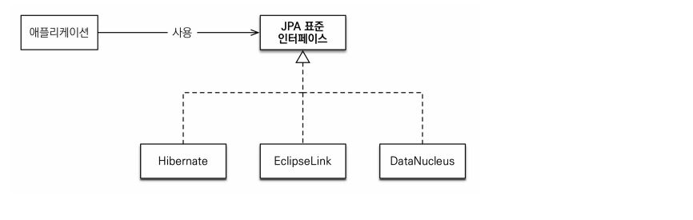
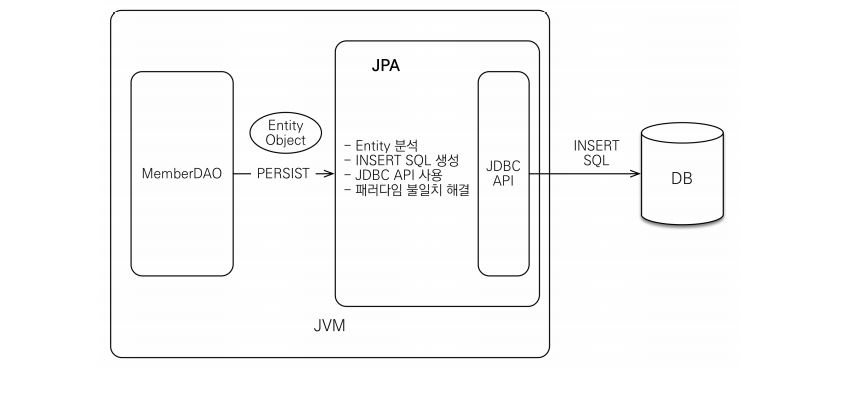
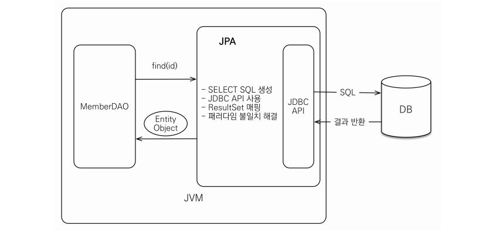
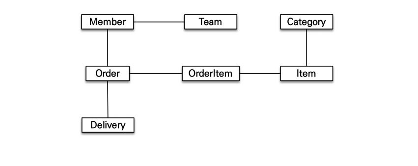
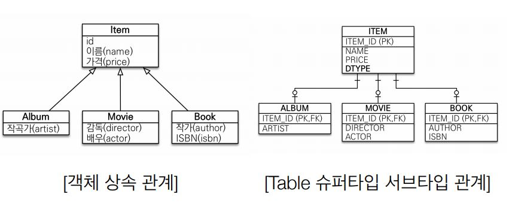
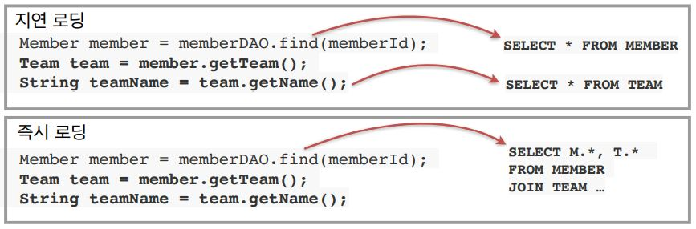

# ORM 이란?

- Object-relational mapping(객체 관계 매핑)
- 객체는 객체대로 설계
- 관계형 데이터베이스는 관계형 데이터베이스대로 설계
- ORM 프레임워크가 중간에서 매핑
- 대중적인 언어에는 대부분 ORM 기술이 존재

> ORM 은 RDB 와 OOP 라는 두 기둥 사이에 존재하는 녀석이다. 따라서 RDB 와 OOP 에 대해서 잘 알고 있어야 한다.

# JPA 란 ?

### JPA 는 자바 진영에서 제공하는 표준 ORM 프레임워크이다.

> JPA 는 자바 ORM 기술에 대한 API 표준 명세이다. 쉽게말해 인터페이스를 모아둔 것이다. 따라서 JPA 를 사용하려면 JPA 를 구현한 ORM 프레임워크를 선택해야 한다.



ORM(Object-Relational Mapping)은 이름 그대로 객체와 관계형 데이터베이스를 매핑한다는 뜻이다. 따라서 패러다임 불일치 문제를 해결해 준다. 그 중에서 `하이버네이트 ORM 프레임워크`를 가장 많이 사용한다.

- JPA 의 내부 구조
 - 자바 애플리케이션 안에 JPA 가 있고 JPA 안에 JDBC API 가 있어서 DB와 통신한다.
 - DAO 에서 persist(entity object) 를 통해 JPA 와 통신하고 JPA 에서는 다음과 같은 과정을 거친다.
   - 1. Entity 분석
   - 2. SQL 생성
   - 3. JDBC API 사용하여 DB 와 통신
   - 4. 패러다임 불일치 해결

### JPA 동작 - 저장



### JPA 동작 - 조회



### 이미 대세는 JPA + Hibernate 이다.

유독 한국만 SI 문화가 발달되서 주변에 iBatis or myBatis 환경이 많은 것이지 2014년 6월 기준으로 구글 트렌드로 따졌을 때 비율은 다음과 같다.

- JPA + Hibernate : 94%
- iBatis + myBatis : 6%

# JPA 를 사용했을 때의 장점

### 애플리케이션을 SQL 이 아닌 객체 중심으로 개발할 수 있다.

- 생산성이 좋아진다.
  - SQL 작성과 JDBC API 작업에 관한 반복적인 일을 JPA 가 대신 처리한다.
- 유지보수성이 좋아진다.
  - SQL 의존적인 개발에서는 엔티티에 필드 하나가 추가되면 JDBC API 부터 SQL 까지 코드를 많이 수정해야한다. 반면 JPA 는 이런 과정을 대신 처리해 준다. JPA 를 사용하면 필드만 추가하면 된다. SQL 은 JPA 가 처리한다. 따라서 유지보수해야하는 코드가 줄어든다.
- 성능
  - JPA 는 애플리케이션과 데이터베이스 사이에서 다양한 성능 최적화 기회를 제공한다. JPA 는 애플리케이션과 데이터베이스 사이에서 동작한다.
  - JPA 는 다양한 성능 최적화 기능을 제공해서 잘 이해하고 사용하면 SQL 을 직접 다루는 것보다 더 좋은 성능을 낼 수 있다.
  - 또한 네이티브 SQL 기능을 사용해서 직접 SQL 을 호출할 수도 있다.
  - 통계같은 복잡한 쿼리는 SQL 을 직접 작성하는 편이 더 좋을 수 있다. JPA 는 통계같은 쿼리보다는 `실시간 처리용 쿼리`에 더 최적화 되어 있다.
  - 따라서 통계같은 쿼리는 `네이티브 SQL or 마이바티스같은 SQL Mapper` 를 사용하는 것이 더 좋을 수 있다.
- 데이터 접근 추상화와 벤더 독립성
  - 관계형 DB 는 같은 기능도 벤더마다 사용법이 다르다. (ex. 페이징  쿼리)
  - 반면, JPA 는 애플리케이션과 데이터베이스 사이에 추상화된 데이터 접근 계층을 제공해서 특정 DB 에 종속되지 않도록 한다.
- 표준
  - 표준이기 때문에 다른 구현 기술로 손쉽게 변경할 수 있다.
- 테스트 작성이 편리하다.
- 버그가 많이 줄어든다.
- 개발 단계에서 MySQL 을 사용하다가 오픈 시점에 Oracle 로 DB 가 바뀌더라도 코드 수정이 거의 없이 DB 를 변경할 수 있다.
- 반복적인 CRUD SQL 을 작성하고 객체를 SQL 에 매핑하는 시간을 줄일 수 있다.
- SQL 에 의존적인 개발을 하지 않을 수 있다.

### 객체와 관계형 데이터베이스의 패러다임 불일치 문제를 해결해 준다.

[객체를 테이블에 맞춰 모델링 vs 객체지향 모델링](https://github.com/BAEKJungHo/JPA/blob/main/basic/02.%20%EA%B0%9D%EC%B2%B4%EC%A7%80%ED%96%A5%20%EB%AA%A8%EB%8D%B8%EB%A7%81.md)

### JPA 를 사용하면 객체 그래프를 마음껏 탐색할 수 있다.

SQL 을 직접 다루는 경우에는 처음 실행하는 SQL 에 따라 객체 그래프를 어디까지 탐색할 수 있는지 정해진다.



```java
member.getOrder().gerOrderItem(); // 객체 그래프 탐색
```

- 이 기능은 실제 객체를 사용하는 시점까지 데이터베이스 조회를 미룬다고해서 `지연 로딩` 이라고 한다.

```java
// 지연 로딩 사용
// 처음 조회 시점에 SELECT SQL
Member member = jpa.find(Member.class, memberId);
Order order = member.getOrder();
order.getOrderDate(); // Order 를 사용하는 시점에 SELECT SQL
```

### JPA 는 같은 트랜잭션일 때 같은 객체가 조회되는 것을 보장한다.

```java
String id = "100";
User user1 = jpa.find(User.class, id);
User user2 = jpa.find(User.class, id);

user1 == user2; // 주소 값이 같다.
```

__동일한 트랜잭션에서 조회한 엔티티는 같은 객체가 조회되는 것을 보장한다.__

## 상속과 슈퍼타입/서브타입



- 객체는 참조, 테이블은 외래키

## JPA 의 성능 최적화 기능

- 1차 캐시와 동일성(identity) 보장
- 트랜잭션을 지원하는 쓰기 지연(transactional write-behind)
- 지연 로딩(Lazy Loading)

### 1차 캐시와 동일성(identity) 보장

1. 같은 트랜잭션 안에서는 같은 엔티티를 반환 - 약간의 조회 성능 향상
2. [DB Isolation Level 이 Read Commit 이어도 애플리케이션에서 Repeatable Read 보장](https://joont92.github.io/db/%ED%8A%B8%EB%9E%9C%EC%9E%AD%EC%85%98-%EA%B2%A9%EB%A6%AC-%EC%88%98%EC%A4%80-isolation-level/)

```java
String id = "100";
User user1 = jpa.find(User.class, id); // SQL
User user2 = jpa.find(User.class, id); // 캐시

user1 == user2; // 주소 값이 같다.
```

SQL 1번만 실행

### 트랜잭션을 지원하는 쓰기 지연(transactional write-behind)

- INSERT

1. 트랜잭션을 커밋할 때까지 INSERT SQL 을 모음
2. JDBC BATCH SQL 기능을 사용해서 한번에 SQL 전송

```java
transaction.begin(); // [트랜잭션] 시작

em.persist(memberA);
em.persist(memberB);
em.persist(memberC);
//여기까지 INSERT SQL을 데이터베이스에 보내지 않는다.

//커밋하는 순간 데이터베이스에 INSERT SQL을 모아서 보낸다.
transaction.commit(); // [트랜잭션] 커밋
```

- UPDATE

1. UPDATE, DELETE 로 인한 로우(ROW)락 시간 최소화
2. 트랜잭션 커밋 시 UPDATE, DELETE SQL 실행하고, 바로 커밋

```java
transaction.begin(); // [트랜잭션] 시작

changeMember(memberA); 
deleteMember(memberB); 
비즈니스_로직_수행(); // 비즈니스 로직 수행 동안 DB 로우 락이 걸리지 않는다. 

//커밋하는 순간 데이터베이스에 UPDATE, DELETE SQL을 보낸다.
transaction.commit(); // [트랜잭션] 커밋
```

### 지연 로딩과 즉시 로딩

- 지연 로딩: 객체가 실제 사용될 때 로딩
- 즉시 로딩: JOIN SQL 로 한번에 연관된 객체까지 미리 조회


