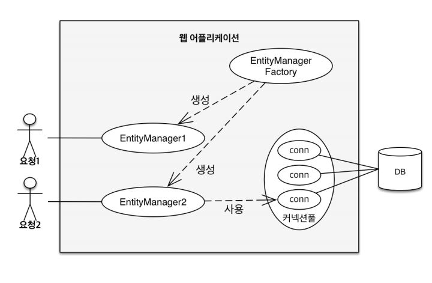
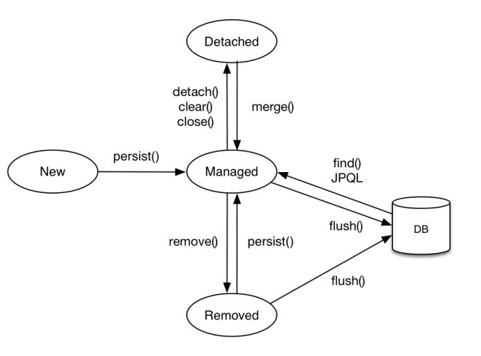
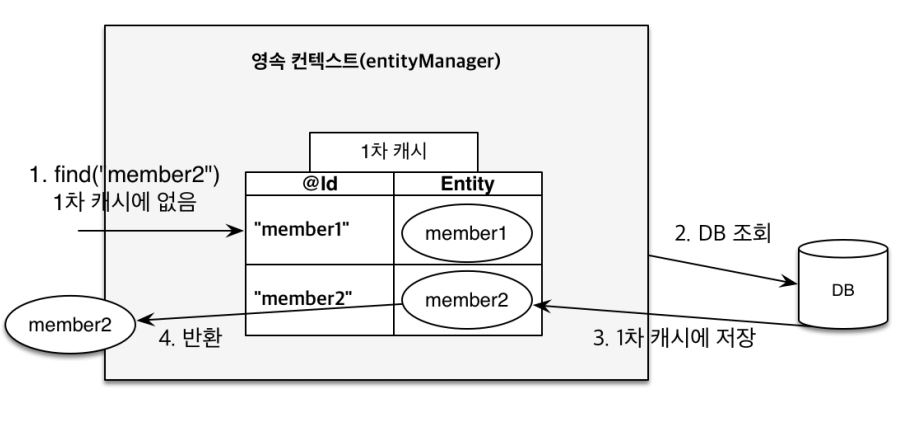
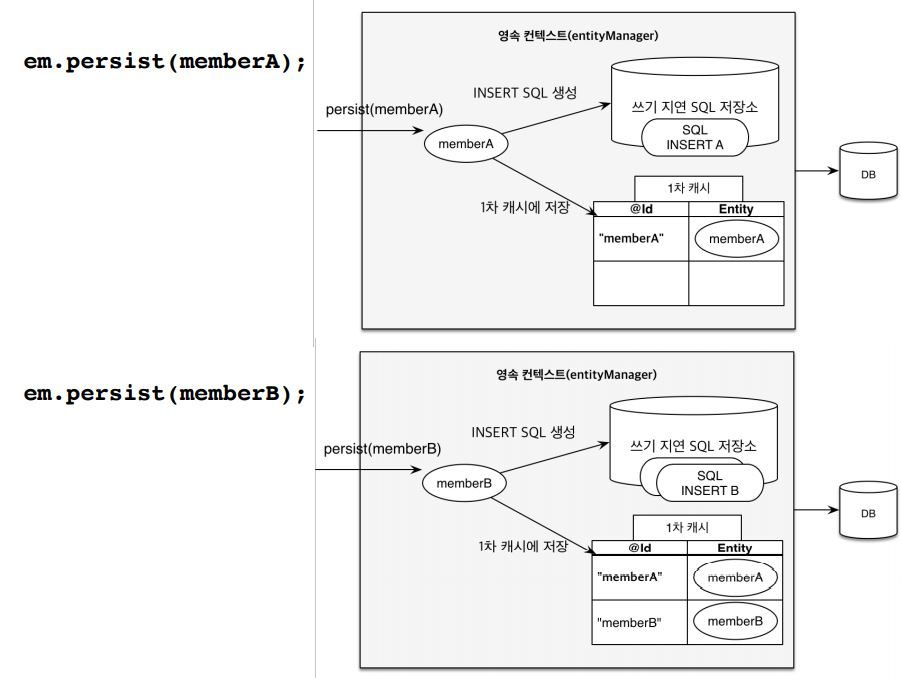
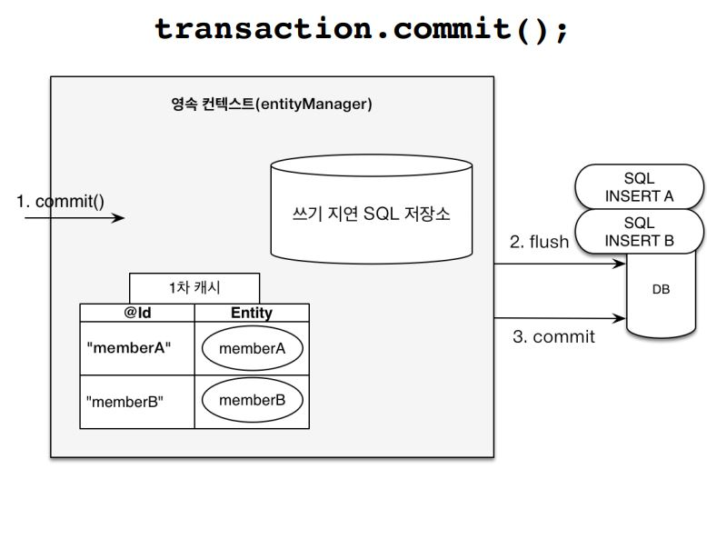
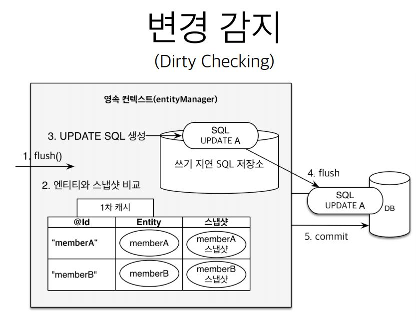

# 엔티티 매니저 팩토리와 엔티티 매니저



# 영속성 컨텍스트(persistence context)

영속성 컨텍스트(persistence context) 란 `엔티티를 영구 저장하는 환경`을 의미한다.

엔티티 매니저는 영속성 컨테스트에 엔티티를 보관하고 관리한다.

```java
em.persist(entity);
```

persist 는 __엔티티 매니저를 사용해서 회원 엔티티를 영속성 컨텍스트에 저장한다.__

영속성 컨텍스트는 논리적인 개념에 가깝고 눈에 보이지 않는다. 영속성 컨텍스트는 엔티티 매니저를 생성할 때 하나 만들어진다. 그리고 엔티티 매니저를 통해 영속성 컨텍스트에 접근할 수 있고,
관리할 수 있다.

> 여러 엔티티 매니저가 같은 영속성 컨텍스트에 접근할 수도 있다.

## 1. 엔티티의 생명주기

- 비영속(new/transient) : 영속성 컨텍스트와 전혀 관계가 없는 상태
- 영속(managed) : 영속성 컨텍스트에 저장된 상태
  - em.persist(entity)
- 준영속(detached) : 영속성 컨텍스트에 저장되었다가 분리된 상태
  - em.detach()
  - em.clear()
  - em.close()
- 삭제(removed) : 삭제된 상태
  - em.remove(entity)

```java
// 비영속
Member member = new Member();
member.setId(100L);
member.setName("DOPE");

// 영속
em.persist(member);
```



## 2. 영속성 컨텍스트의 특징

- J2SE 환경
  - EntityManager 와 PersistenceContext 가 1:1
- J2EE, Spring Framework 같은 컨테이너 환경
  - EntityManager 와 PersistenceContext 가 N:1

### 영속성 컨텍스트와 식별자 값

영속성 컨텍스트는 엔티티를 식별자 값(@Id 로 테이블의 기본키와 매핑한 값)으로 구분한다. 따라서 __영속 상태는 식별자 값이 반드시 있어야 한다.__ 식별자 값이 없으면 예외가 발생한다.

### 영속성 컨텍스트와 데이터베이스 저장

JPA 는 보통 트랜잭션을 커밋하는 순간 영속성 컨텍스트에 새로 저장된 엔티티를 데이터베이스에 반영하는데 이것을 `플러시(flush)`라 한다.

즉, em.persist(entity) 를 한다고 SQL 문이 실행되는 것이 아니다. 이때는 영속성 컨텍스트에 엔티티가 저장되는 순간이고, 트랜잭션이 커밋되는 시점에 JPA 가 SQL 문을 만들어서 실행한다.

### 영속성 컨텍스트가 엔티티를 관리하면 다음과 같은 장점이 있다.

- 1차 캐시
- 동일성 보장
- 트랜잭션을 지원하는 쓰기 지연
- 변경 감지
- 지연 로딩

## 3. 1차 캐시

영속성 컨텍스트는 내부에 캐시를 가지고 있는데 이것을 1차 캐시라 한다. 영속 상태의 엔티티는 모두 이곳에 저장된다. 영속성 컨텍스트 내부에 Map 이 하나 있는데 키는 @Id 로 매핑한 식별자이고, 값은
엔티티 인스턴스이다. 따라서 영속성 컨텍스트에 데이터를 저장하고 조회하는 모든 기준은 데이터베이스 기본 키 값이다.

```java
// EntityManager.find() 메서드 정의
public <T> T find(Class<T> entityClass, Object primaryKey);
```

em.find() 를 호출하면 가장 먼저 `1차 캐시`에서 엔티티를 찾고 만약에 없으면 데이터베이스에서 조회한다.

- 1차 캐시에 있는 엔티티 조회

```java
User user = new User();
user.setId("user1");
user.setUsername("홍길동");

// 1차 캐시에 저장됨
em.persist(user);

// 1차 캐시에서 조회
User findUser = em.find(User.class, "user1");
```

- 데이터베이스에서 조회

만약에 1차 캐시에 엔티티가 없으면, 엔티티 매니저는 데이터베이스를 조회해서 엔티티를 생성하고, 1차 캐시에 저장한 후에 영속 상태의 엔티티를 반환한다.

```java
User findUser2 = em.find(User.class, "user2");
```


 
## 4. 영속성 컨텍스트는 성능상 이점과 엔티티의 동일성을 보장한다.

- 동일성(identity)
  - 실제 인스턴스가 같다. 참조 값을 비교하는 == 비교의 값이 같다.
- 동등성(equality)
  - 실제 인스턴스는 다를 수 있지만 인스턴스가 가지고 있는 값이 같다. 자바에서 동등성 비교는 equals() 메서드를 구현해야 한다.

```java
Member a = em.find(Member.class, "member1"); 
Member b = em.find(Member.class, "member1");
System.out.println(a == b); //동일성 비교 true
```

> JPA 는 1차 캐시를 통해 반복 가능한 읽기(REPEATABLE READ) 등급의 트랜잭션 격리 수준을 데이터베이스가 아닌 애플리케이션 차원에서 제공한다는 장점이 있다.

## 5. 쓰기 지연(transactional wirte-behind)

JPA 는 보통 트랜잭션을 커밋하는 순간 영속성 컨텍스트에 새로 저장된 엔티티를 데이터베이스에 반영하는데 이것을 `플러시(flush)`라 한다. (플러시가 먼저 동작하고 커밋이 동작한다.
JPA 가 알아서 커밋할 때 플러시를 먼저 호출해 준다.)

즉, em.persist(entity) 를 한다고 SQL 문이 실행되는 것이 아니다. 이때는 영속성 컨텍스트에 엔티티가 저장되는 순간이고, 트랜잭션이 커밋되는 시점에 JPA 가 SQL 문을 만들어서 실행한다.

엔티티 매니저는 트랜잭션을 커밋하기 직전까지 데이터베이스에 엔티티를 저장하지 않고, __내부 쿼리 저장소에 INSERT SQL__ 을 차곡차곡 모아둔다. 그리고 트랜잭션이 커밋될 때 모아둔 쿼리를
데이터베이스에 보낸다. 이것을 `쓰기 지연(transactional wirte-behind)` 이라고 한다.

트랜잭션을 커밋하면 엔티티 매니저는 우선 영속성 컨텍스트를 플러시한다. 플러시(flush)는 영속성 컨텍스트의 변경 내용을 데이터베이스에 동기화 하는 작업인데 이때 등록,수정,삭제한 엔티티를
데이터베이스에 반영한다. 즉, 쓰기 지연 SQL 저장소에 모인 쿼리를 데이터베이스에 보낸다. 이렇게 영속성 컨텍스트의 변경 내용을 데이터베이스에 동기화한 후에 실제 데이터베이스 트랜잭션을 커밋한다.

쓰기 지연을 잘 활용하면 모아둔 등록 쿼리를 데이터베이스에 한 번에 전달해서 성능을 최적화 할 수 있다. (이것을 batch 라고 한다.)

쓰기 지연이 가능한 이유는 등록 쿼리를 여러 번 날리고 커밋을 하던, 등록 쿼리를 커밋 시점에 한꺼번에 DB 에 저장하던 결과는 같다. 중요한 것은 커밋 직전에만 데이터베이스에 SQL 을 전달하면 되기 때문이다.

```java
EntityManager em = emf.createEntityManager();
EntityTransaction transaction = em.getTransaction();
//엔티티 매니저는 데이터 변경시 트랜잭션을 시작해야 한다.

transaction.begin(); // [트랜잭션] 시작
em.persist(memberA);
em.persist(memberB);
//여기까지 INSERT SQL을 데이터베이스에 보내지 않는다.

//커밋하는 순간 데이터베이스에 INSERT SQL을 보낸다.
transaction.commit(); // [트랜잭션] 커밋
```





## 6. SQL 수정 쿼리의 문제점

SQL 을 사용하면 수정 쿼리를 직접 작성한다. 회원의 이름과 나이를 변경하는 기능을 개발하다가, 나중에 등급을 변경하는 기능이 추가되면 쿼리를 하나 더 만들거나 기존 쿼리에 새로운 기능을 추가하거나
그래야 한다. 하지만 하나의 합친 쿼리를 사용하게 되면 실수로 이름, 나이를 빼먹을 수도 있고 혹은 등급을 빼먹을 수도 있게된다.

즉, __이런 개발 방식의 문제점은 수정 쿼리가 많아지는 것은 물론이고 비지니스 로직을 분석하기 위해 SQL 을 계속 확인해야 한다. 결국 직접적이든 간접적이든 비지니스 로직이 SQL 에 의존하게 된다.__

## 7. 변경 감지(dirty checking)

JPA 로 엔티티를 수정할 때는 단순히 엔티티를 조회해서 데이터만 변경하면 된다. 

- 변경 감지(dirty checking)
 - 1. flush() : 트랜잭션을 커밋하면 엔티티 매니저 내부에서 먼저 플러시가 호출된다.
 - 2. 엔티티와 스냅샷 비교 : 엔티티와 스냅샷을 비교해서 변경된 엔티티를 찾는다.
 - 3. SQL UPDATE : 변경된 엔티티가 있으면 수정 쿼리를 생성해서 쓰기 지연 SQL 저장소(내부 쿼리 저장소)에 보낸다.
 - 4. flush() : 쓰기 지연 저장소의 SQL 을 데이터베이스에 보낸다.
 - 5. commit() : 트랜잭션을 커밋한다.

JPA 는 엔티티를 영속성 컨텍스트에 보관할 때, 최초 상태를 복사해서 저장해두는데 이것을 `스냅샷(snapshot)` 이라고 한다. 그리고 플러시 시점에 스냅샷과 엔티티를 비교해서 변경된 엔티티를 찾는다.

> 즉, 1차 캐시 안에 영속성 컨텍스트가 있는데, Map 으로 Key:@Id / Value:Entity 가 존재하고 거기에 추가로 스냅샷이 존재한다.

__변경 감지는 영속성 컨텍스트가 관리하는 영속 상태의 엔티티에만 적용된다.__ 비영속, 준영속처럼 영속성 컨텍스트의 관리를 받지 못하는 엔티티는 값을 변경해도 데이터베이스에 반영되지 않는다.

__JPA 의 기본 전략은 엔티티의 모든 필드를 업데이트 한다.__

이렇게 모든 필드를 사용하면 데이터베이스에 보내는 데이터 전송량이 증가하는 단점이 있지만, 아래와 같은 장점이 있어서 모든 필드를 업데이트 한다.

- 모든 필드를 사용하면 수정 쿼리가 항상 같다.(물론 바인딩 되는 데이터는 다르다.) 따라서 애플리케이션 로딩 시점에 수정 쿼리를 미리 생성해 두고 재사용할 수 있다.
- 데이터베이스에 동일한 쿼리를 보내면 데이터베이스는 이전에 한 번 파싱된 쿼리를 재사용할 수 있다.

만약에, 필드가 많거나 저장되는 내용이 너무 크면 수정된 데이터만 사용해서 동적으로 UPDATE SQL 을 생성하는 전략을 사용하면 된다. 이 때는 하이버네이트 확장 기능을 사용해야 한다.

```java
@Entity
@org.hibernate.annotations.DynamicUpdate
@Table(name = "User")
public class User { }
```



```java
EntityManager em = emf.createEntityManager();
EntityTransaction transaction = em.getTransaction();
transaction.begin(); // [트랜잭션] 시작
// 영속 엔티티 조회
Member memberA = em.find(Member.class, "memberA");
// 영속 엔티티 데이터 수정
memberA.setUsername("hi");
memberA.setAge(10);
//em.update(member) 이런 코드가 없어도 된다.
transaction.commit(); // [트랜잭션] 커밋
```

> 상황에 따라 다르지만 컬럼이 대략 30개 이상이 되면 기본 방법인 정적 수정 쿼리보다 @DynamicUpdate 를 사용한 동적 수정 쿼리가 빠르다고 한다. 추천하는 방법은 기본 전략을 사용하고, 최적화가 필요할 정도로 느리면 그때 전략을 수정하면 된다. 만약에 한 테이블에 컬럼이 30개 이상이 되면 책임이 적절하게 분리되지 않았을 가능성이 크다.

## 8. 엔티티 삭제

```java
em.remove(entity);
```

em.remove 에 entity 를 넘겨주면 엔티티를 삭제한다. 삭제도 마찬가지로 쓰기 지연 SQL 저장소에 등록되었다가 커밋해서 플러시를 호출하면 그때 데이터베이스에 삭제 쿼리를 전달한다.
em.remove 를 호출하는 순간 해당 엔티티는 영속성 컨텍스트에서 제거가 된다. 이렇게 삭제된 엔티티는 재사용하지 말고 가비지 컬렉션에 의해 회수되도록 냅두는 것이 좋다.

## 9. 플러시(flush())

__플러시(flush())는 영속성 컨텍스트의 변경 내용을 데이터베이스에 반영(동기화)한다.__

- 플러시를 실행한 경우 동작 방식
  - 변경 감지가 동작해서 영속성 컨텍스트에 있는 모든 엔티티를 스냅샷과 비교해서 수정된 엔티티를 찾는다. 수정된 엔티티는 수정 쿼리를 만들어 쓰기 지연 SQL 저장소에 등록한다.
  - 쓰기 지연 SQL 저장소의 쿼리를 데이터베이스에 전송한다.(등록, 수정, 삭제 쿼리)

- 영속성 컨텍스트를 플러시 하는 방법
  - em.flush() 를 직접 호출한다.
    - 테스트나 다른 프레임워크와 JPA 를 함께 사용할 때를 제외하고 거의 사용하지 않는다.
  - 트랜잭션 커밋 시 플러시가 자동 호출된다.
    - 엔티티의 변경사항을 SQL 로 DB 에 전달하지 않은 상태에서 커밋하면 무용지물이기 때문에, JPA 는 커밋할때 플러시를 먼저 알아서 호출해주고 커밋을 한다.
  - JPQL 쿼리 실행 시 플러시가 자동 호출된다.
    - JPQL 이나 Criteria 같은 객체지향 쿼리를 호출할 때도 플러시가 실행된다.

- 플러시 모드 옵션
  - FlushModeType.AUTO : 커밋이나 쿼리를 실행할 때 플러시(Default)
  - FlushModeType.COMMIT : 커밋할 때만 플러시

## 10. 준영속

준영속은 영속성 컨텍스트가 관리하는 영속 상태의 엔티티가 `영속성 컨텍스트에서 분리된(detached)` 것을 의미 한다. 따라서 __준영속 상태의 엔티티는 영속성 컨텍스트가 제공하는 기능을 사용할 수 없다.__

- 영속 상태를 -> 준영속 상태로 만드는 방법
  - em.detach(entity) : 특정 엔티티만 준영속 상태로 전환
  - em.clear() : 영속성 컨텍스트를 완전히 초기화
  - em.close() : 영속성 컨텍스트를 종료

__준영속 상태는 영속성 컨텍스트가 관리하지 않는 상태를 의미하므로, 트랜잭션 커밋을 해도 데이터베이스에 SQL 이 반영되지 않는다.__

### 특징

- 거의 비영속 상태에 가깝다
  - 1차 캐시, 쓰기 지연, 변경 감지, 지연 로딩 등의 어떠한 기능도 동작하지 않는다.
- 식별자 값을 가지고 있다.
- 지연 로딩(Lazy Loading)을 할 수 없다.
  - 지연 로딩은 실제 객체 대신 프록시 객체를 로딩해두고 해당 객체를 실제 사용할 때 영속성 컨텍스트를 통해 데이터를 불러오는 방법이다.

### 병합(merge())

병합(merge())을 사용하면 준영속 상태의 엔티티를 다시 영속 상태로 만들 수 있다.

- merge()

```java
public <T> T merge(T entity);
```

- Example

```java
User mergeUser = em.merge(user);
```

- 병합은 비영속 엔티티도 영속 상태로 만들 수 있다.

```java
User user = new User();
User newUser = em.merge(user);
tx.commit();
```
