# 연관관계 매핑

객체 관계 매핑(ORM)에서 가장 어려운 부분이 바로 객체 연관관계와 테이블 연관관계를 매핑하는 일이다. 즉, __객체의 참조와 테이블의 외래 키를 매핑하는 것__ 이 중요하다.

- 방향(Direction)
  - 단방향
    - 회원 -> 회사 or 회사 -> 회원 둘 중 한쪽만 참조하는 것
  - 양방향
    - 테이블은 항상 양방향이다.

- 다중성(Multiplicity)
  - 다대일(N:1) : 회원(N)이 속한 회사(1)를 조회
  - 일대다(1:N) : 회사(1)가 자기 회원(N)을 조회
  - 일대일(1:1) 
  - 다대다(N:M)

- 연관관계의 주인(owner)
  - 객체를 양방향 연관관계로 만들면 연관관계의 주인을 정해야 한다.

## 연관관계가 필요한 이유

`객체지향 설계의 목표는 자율적인 객체들의 협력 공동체를 만드는 것이다. - 객체지향의 사실과 오해`

## 다대일 연관관계

- 객체 연관관계
  - 회원이 회사를 조회하는 다대일 연관관계의 경우 회원 필드에는 회사를 참조하고 있는 필드가 존재한다. 반면 회사 엔티티에는 회원을 참조하는 필드가 존재하지 않는다.
- 테이블 연관관계
  - 회원 테이블은 회사의 외래키를 가지고 있어서 서로 조인하여 조회할 수 있다. 따라서 양방향 연관관계이다.

> 객체 연관관계와 테이블 연관관계의 가장 큰 차이
>
> 객체간에 연관관계를 양방향으로 만들고 싶으면 반대쪽에도 참조하는 필드를 추가해야 한다. 결국 연관관계를 하나 더 만들어야 하는데 정확히는 `양방향이 아니라 서로 다른 단방향 관계가 2개`인 것이다.
> 반면, 테이블은 외래 키 하나로 양방향으로 조인할 수 있다.

객체를 테이블에 맞추어 데이터 중심으로 모델링하면, 협력 관계를 만들 수 없다. 객체는 `참조`를 사용해서 연관된 객체를 찾는다.

## @ManyToOne

테이블은 항상 양방향 연관관계를 가진다. 하지만 객체는 사실상 양방향 연관관계를 가지지 못하고, 비지니스 규칙으로 잘 묶어서 서로 다른 단방향 연관관계를 양방향 처럼 보이게 하는 것이다.

서로 다른 엔티티에서 양방향 연관관계처럼 보이게 하기 위해서는 @ManyToOne or @OneToMany 를 설정해야 한다. (혹은 @OneToOne) 여기서 `연관관계의 주인`을 설정해야하는데, __연관관계의 주인이란
테이블의 외래키를 수정하고 다룰 수 있는 엔티티를 의미한다.__ 연관관계의 주인은 항상 `@ManyToOne`쪽이 된다. 즉, 테이블에서 실제로 FK 를 가지고 있는 테이블이 연관관계의 주인이 된다.

## 식별관계와 비식별관계

식별관계는 한 테이블의 기본키가 다른 테이블에서 기본키 + 외래키로 사용되는 경우인데, 식별관계를 사용하는 경우 `@IdClass` 난 `@EmbeddedId` 를 사용해야 한다. 식별관계의 복합키를 사용하는 경우보다 비식별관계처럼 인조키를 만들어 사용하는 편이 더 편하다. 

식별관계는 테이블의 기본키를 자식 테이블로 전파하면서 자식 테이블의 기본키 컬럼이 점점 늘어난다. 그리고 식별관계는 2개 이상의 컬럼을 합해서 복합키로 사용하는 경우가 많다.
__식별 관계를 사용할 때 기본 키로 비지니스 의미가 있는 자연 키 컬럼을 조합하는 경우가 많은데, 비지니스는 언제든 변경될 가능성이 있다.__ 따라서, 비식별 관계 처럼 인조키를 만들어 주로 사용한다.

__가급적, 비식별 관계를 사용하고 기본 키는 Long 타입의 대리키를 사용하는 것이다.__ 그리고 선택적 비식별 관계보다는 필수적 비식별 관계를 사용하는 것이 좋다.
선택적 비식별관계는 NULL 을 허용하므로 조인할 때 외부조인을 사용해야 한다. 반면 필수적 비식별 관계는 NOT NULL 이기 때문에 항상 관계가 있다는 것을 보장하므로 내부 조인만 사용해도 된다.

## 양방향 연관관계

> 테이블은 외래 키 하나로 두 테이블의 연관관계를 관리. 객체는 외래키가 아닌 참조를 통해서 연관된 객체를 찾는다.

- 양방향 매핑 규칙
  - 객체의 두 관계중 하나를 연관관계의 주인으로 지정
  - `연관관계의 주인만이 외래 키를 관리(등록, 수정)`
  - `주인이 아닌쪽은 읽기만 가능`
  - 주인은 mappedBy 속성 사용 X 
  - 주인이 아니면 mappedBy 속성으로 주인 지정
  - 연관관계의 주인은 항상 `多` 쪽인 `@ManyToOne`이 된다. 그리고 `One` 쪽이 mappedBy 속성을 사용하는 쪽이 된다.

- 누구를 주인으로?
  - 외래키가 있는 곳을 주인으로 정한다.

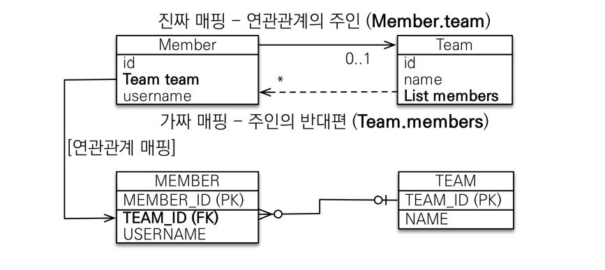

### 연관관계의 주인과 mappedBy

> 객체와 테이블의 연관관계를 맺는 차이를 이해해야 한다.

Member 와 Team 이라는 객체가 있다고하면 사실상 회원에서 팀으로가는 단방향 연관관계 1개, 팀에서 회원으로가는 단방향 연관관계 1개 총 2개가 있는 것이다. 즉, 객체를 양방향으로 참조하려면
`단방향 연관관계를 2개`만들어야 한다. 반면, 테이블은 외래키(FK) 하나로 양방향으로 조회가 가능하다.

### 양방향 매핑 시 많이 하는 실수 : `연관관계의 주인에 값을 입력하지 않음`

```java
Team team = new Team();
team.setName("TeamA");
em.persist(team);

Member member = new Member();
member.setName("member1");

// 역방향(주인이 아닌 방향)만 연관관계 설정
team.getMembers().add(member);

em.persist(member);
```

### 양방향 매핑시 연관관계의 주인에 값을 입력해야 한다. : `순수한 객체 관계를 고려하면 항상 양쪽다 값을 입력해야 한다.`

```java
Team team = new Team();
team.setName("TeamA");
em.persist(team);

Member member = new Member();
member.setName("member1");

team.getMembers().add(member); 

//연관관계의 주인에 값 설정
member.setTeam(team); //**

em.persist(member)
```

### 양방향 연관관계 주의

- 순수 객체 상태를 고려해서 항상 양쪽에 값을 설정하자
- 연관관계 편의 메소드를 생성하자
- 양방향 매핑시에 무한 루프를 조심하자
  - 예: toString(), lombok, JSON 생성 라이브러리
  - `가급적이면 lombok 을 사용할 때 toString() 은 자제`하는게 좋다. 만약에 Member 와 Team 관계에서 member toString 에서 team 을 호출하면, team 의 toString 을 또 호출하고 무한루프가 발생할 수 있다.
  - JSON 생성 라이브러리도 비슷한데, 결과적으로말하면 `Controller 에서는 절대 Entity 를 반환해서는 안된다.` 왜냐하면 Entity 를 API 스펙에 맞춰 JSON 으로 반환하게되면 무한루프 발생가능성이 있고, 두 번째는 나중에 엔티티를 변경하게 되는 순간 API Spec 이 바뀌어 버리게 된다. Entity 는 DTO 로 변환해서 반환하는것이 좋다.

#### 연관관계 편의 메소드

```java
public class Member {
  // 생략
  
  public void setTeam(Team team) {
    this.team = team;
    team.getMembers().add(this);
  }
}
```

만약에 연관관계 메서드에 비지니스 로직이 결합되어야한다면 메서드 명을 changeTeam 등으로 변경해서 사용하는게 좋다.

### 양방향 매핑 정리

- 단방향 매핑만으로도 이미 연관관계 매핑은 완료
- 양방향 매핑은 반대 방향으로 조회(객체 그래프 탐색) 기능이 추가된 것 뿐
- JPQL 에서 역방향으로 탐색할 일이 많음
- __단방향 매핑을 잘 하고 양방향은 필요할 때 추가해도 됨 (테이블에 영향을 주지 않음)__

### 연관관계의 주인을 정하는 기준

- `비즈니스 로직을 기준으로 연관관계의 주인을 선택하면 안됨`
- `연관관계의 주인은 외래 키의 위치를 기준으로 정해야함`

## 연관관계 매핑 시 고려사항 3가지

- 다중성
  - 다대일 : @ManyToOne
  - 일대다 : @OneToMany
  - 일대일 : @OneToOne
  - 다대다 : @ManyToMany
- 단방향, 양방향
  - 테이블 : 외래키 하나로 양쪽 조인 가능, 사실 방향이라는 개념이 없음
  - 객체 : 참조용 필드가 있는 쪽으로 참조 가능
- 연관관계의 주인
  - 테이블은 외래 키 하나로 두 테이블이 연관관계를 맺음
  - 객체 양방향 관계는 A->B, B->A 처럼 참조가 2군데
  - 연관관계의 주인: 외래 키를 관리하는 참조
  - 주인의 반대편: 외래 키에 영향을 주지 않음, 단순 조회만 가능

### 다대일(N:1)

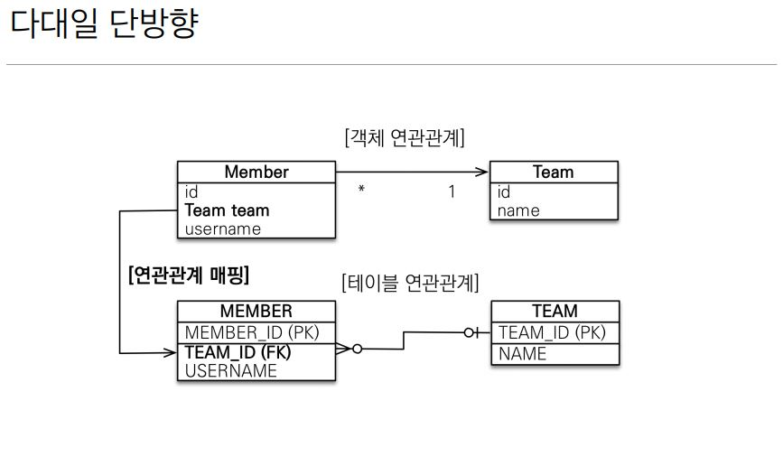

- 다대일 단방향
  - 가장 많이 사용하는 연관관계

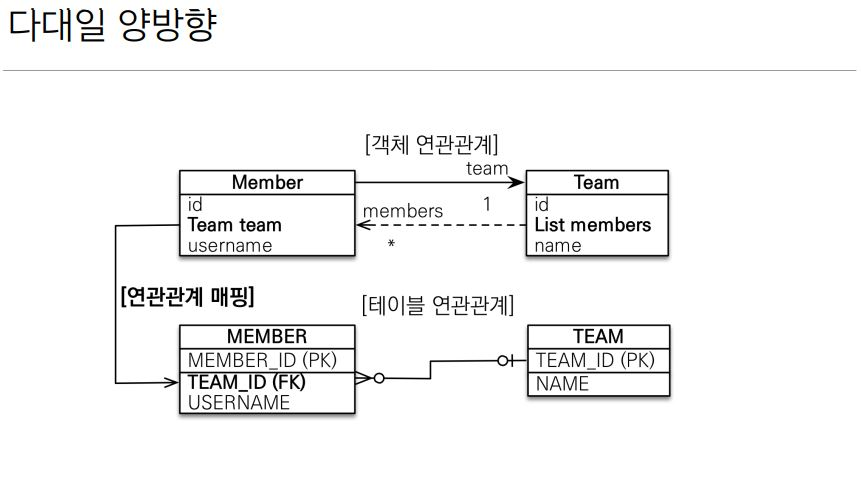

- 다대일 양방향
  - 외래키가 있는 쪽이 연관관계의 주인
  - 양쪽을 서로 참조하도록 개발

### 일대다(1:N)

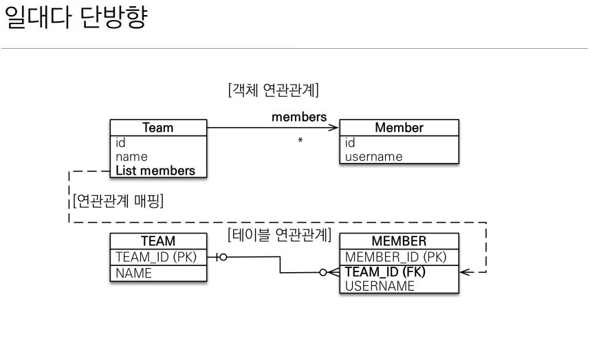

- 일대다 단방향
  - 일대다 단방향은 일대다(1:N)에서 일(1)이 연관관계의 주인
  - 테이블 일대다 관계는 항상 다(N) 쪽에 외래 키가 있음
  - 객체와 테이블의 차이 때문에 반대편 테이블의 외래 키를 관리하는 특이한 구조
  - @JoinColumn을 꼭 사용해야 함. 그렇지 않으면 조인 테이블 방식을 사용함(중간에 테이블을 하나 추가함)

```java
@Entity
public class Team {
  // 생략
  
  @OneToMany
  @JoinColumn(name = "TEAM_ID")
  private List<Member> members = new ArrayList<>();
}
```

- 일대다 단방향 매핑의 단점
  - 엔티티가 관리하는 외래 키가 다른 테이블에 있음
  - 연관관계 관리를 위해 추가로 UPDATE SQL 실행

- `일대다 단방향 매핑보다는 다대일 양방향 매핑을 사용하자`

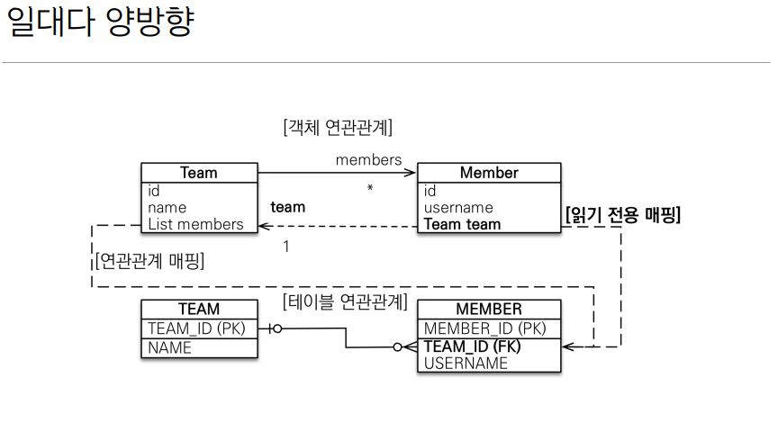

- 일대다 양방향
  - 이런 매핑은 공식적으로 존재X 
  - @JoinColumn(insertable=false, updatable=false) 
  - 읽기 전용 필드를 사용해서 양방향 처럼 사용하는 방법
  - `다대일 양방향을 사용하자`

### 일대일(1:1)

- 일대일 관계는 그 반대도 일대일
- 주 테이블이나 대상 테이블 중에 외래 키 선택 가능
  - 주 테이블에 외래 키
  - 대상 테이블에 외래 키
- 외래 키에 데이터베이스 유니크(UNI) 제약조건 추가

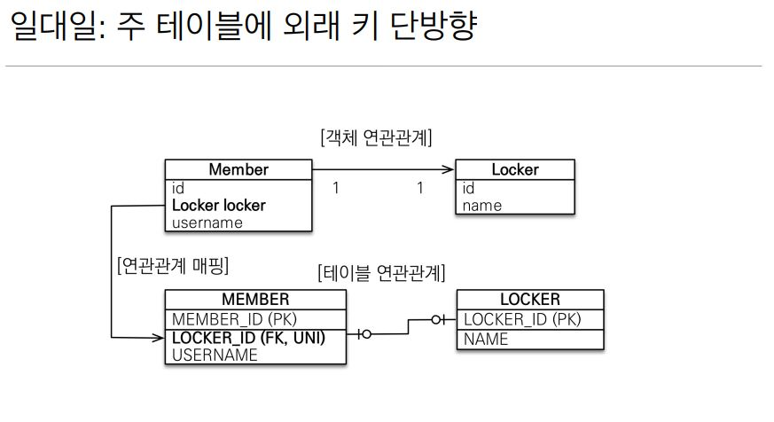

- 일대일 주 테이블에 외래 키 단방향 정리
  - 다대일(@ManyToOne) 단방향 매핑과 유사

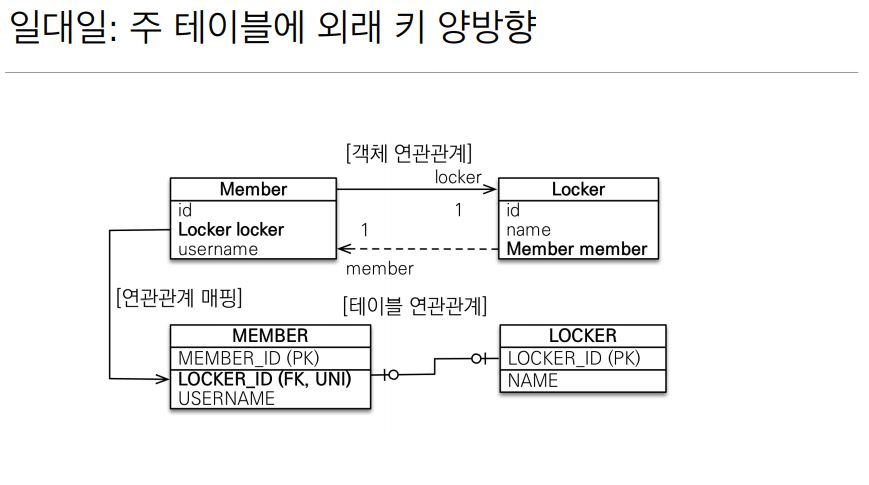

- 일대일 주 테이블에 외래 키 양방향 정리
  - 다대일 양방향 매핑 처럼 외래 키가 있는 곳이 연관관계의 주인
  - 반대편은 mappedBy 적용

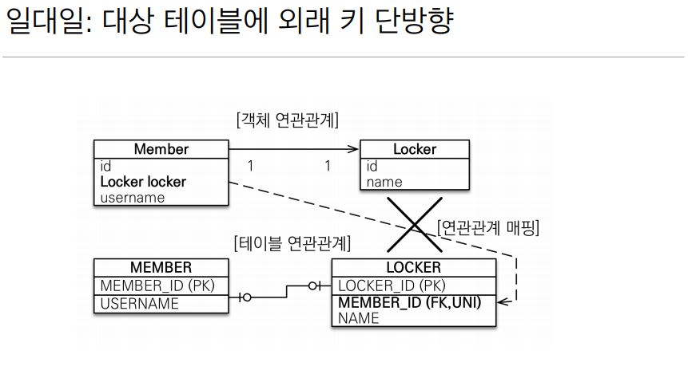

- 일대일 대상 테이블에 외래 키 단방향 정리
  - 단방향 관계는 JPA 지원 X
  - 양방향 관계는 지원

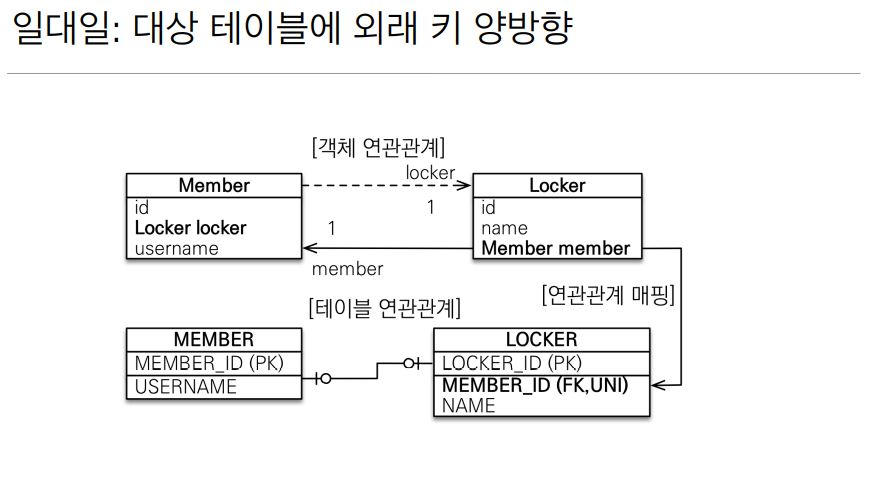

- 일대일 대상 테이블에 외래 키 양방향 정리
  - 사실 일대일 주 테이블에 외래 키 양방향과 매핑 방법은 같음

### 일대일 정리

- 주 테이블에 외래 키
  - 주 객체가 대상 객체의 참조를 가지는 것 처럼 주 테이블에 외래 키를 두고 대상 테이블을 찾음
  - 객체지향 개발자 선호
  - JPA 매핑 편리
  - 장점: 주 테이블만 조회해도 대상 테이블에 데이터가 있는지 확인 가능
  - 단점: 값이 없으면 외래 키에 null 허용
- 대상 테이블에 외래 키
  - 대상 테이블에 외래 키가 존재
  - 전통적인 데이터베이스 개발자 선호
  - 장점: 주 테이블과 대상 테이블을 일대일에서 일대다 관계로 변경할 때 테이블 구조 유지
  - 단점: 프록시 기능의 한계로 지연 로딩으로 설정해도 항상 즉시 로딩됨(프록시는 뒤에서 설명)

### 다대다(N:M)

- 관계형 데이터베이스는 정규화된 테이블 2개로 다대다 관계를 표현할 수 없음
- 연결 테이블을 추가해서 일대다, 다대일 관계로 풀어내야함
- @ManyToMany 사용
   - 실전에서는 @ManyToMany 사용X
   - @ManyToMany는 제약: 필드 추가X, 엔티티 테이블 불일치
- @JoinTable 로 연결 테이블 지정
- 다대다 매핑 : 단방향, 양방향 가능

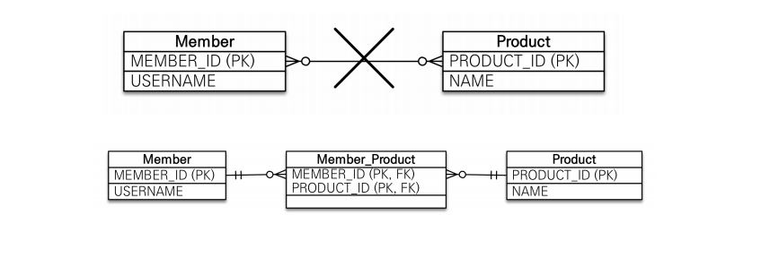

> 객체는 컬렉션을 사용해서 객체 2개로 다대다 관계 가능

- 다대다 매핑의 한계
  - 편리해 보이지만 실무에서 사용X 
  - 연결 테이블이 단순히 연결만 하고 끝나지 않음
  - 주문시간, 수량 같은 데이터가 들어올 수 있음

- 다대다 한계 극복
  - 연결 테이블용 엔티티 추가(연결 테이블을 엔티티로 승격)
  - `@ManyToMany -> @OneToMany, @ManyToOne`

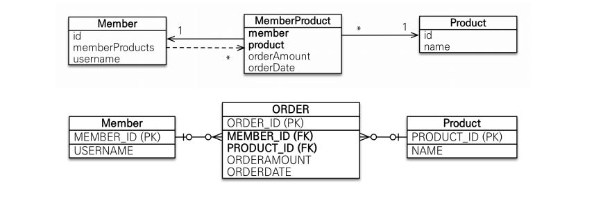

## 주요 속성

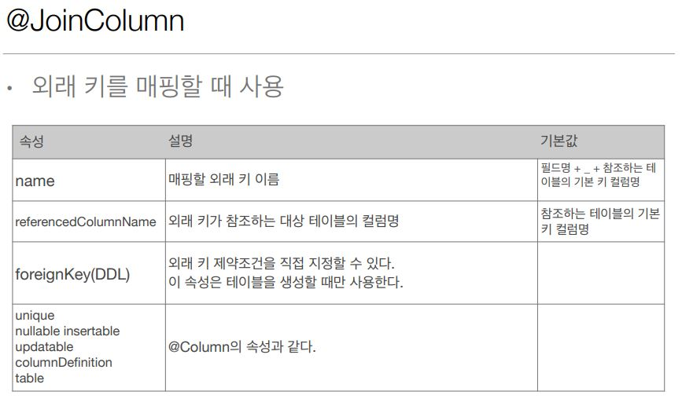

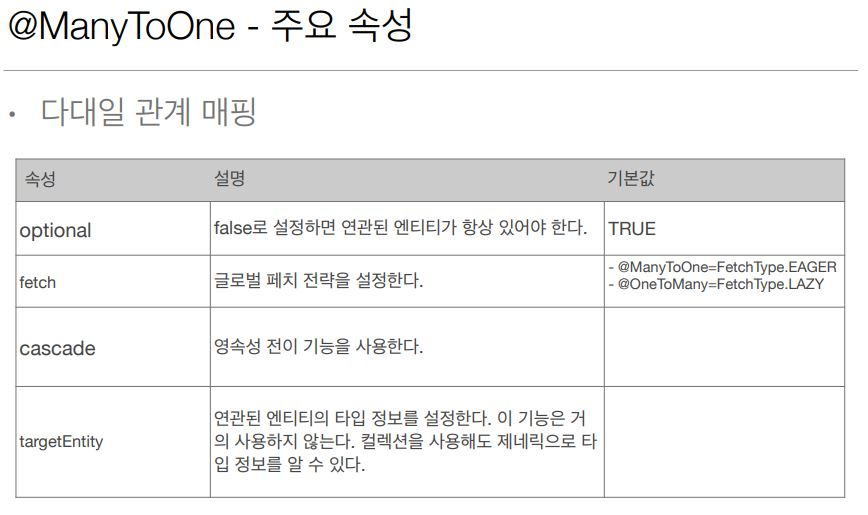

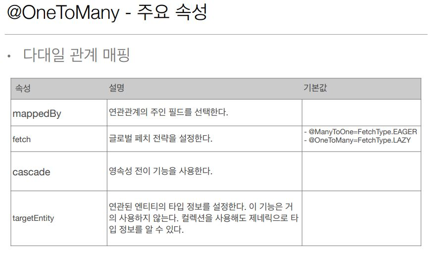

## 상속관계 매핑

- 관계형 데이터베이스는 상속 관계 X 
- 슈퍼타입 서브타입 관계라는 모델링 기법이 객체 상속과 유사
- 상속관계 매핑: 객체의 상속과 구조와 DB의 슈퍼타입 서브타입 관계를 매핑
  - 자바에서는 하위 클래스가 상위 클래스를 상속 받고 있어야 한다. 
  - `class sub extends super`

- 슈퍼타입 서브타입 논리 모델을 실제 물리 모델로 구현하는 방법
  - 각각 테이블로 변환 -> 조인 전략
  - 통합 테이블로 변환 -> 단일 테이블 전략
  - 서브타입 테이블로 변환 -> 구현 클래스마다 테이블 전략

### 주요 어노테이션

- @Inheritance(strategy=InheritanceType.XXX) 
  - JOINED: 조인 전략
  - SINGLE_TABLE: 단일 테이블 전략
  - TABLE_PER_CLASS: 구현 클래스마다 테이블 전략
- @DiscriminatorColumn(name=“DTYPE”) 
  - 상위 테이블에 DTYPE 이라는 컬럼을 생성한다 VARCHAR(31)
- @DiscriminatorValue(“XXX”)
  - 하위 테이블마다 상위 테이블에 들어갈 DTYPE 의 값을 지정할 수 있다. 
  - Ex. @DiscriminatorValue(“Movie”)

### 조인 전략

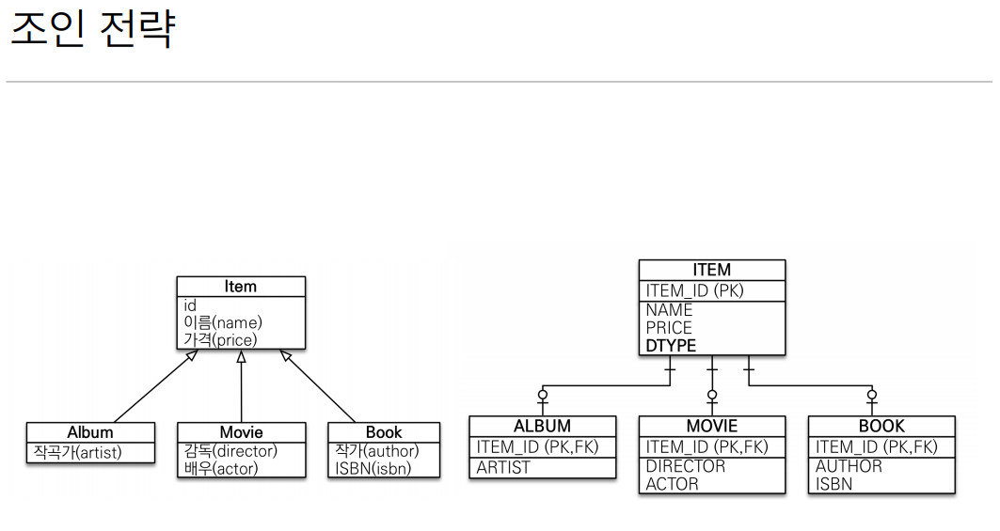

- 장점
  - 테이블 정규화
  - 외래 키 참조 무결성 제약조건 활용가능
  - 저장공간 효율화
- 단점
  - 조회시 조인을 많이 사용, 성능 저하
  - 조회 쿼리가 복잡함
  - 데이터 저장시 INSERT SQL 2번 호출

### 단일 테이블 전략

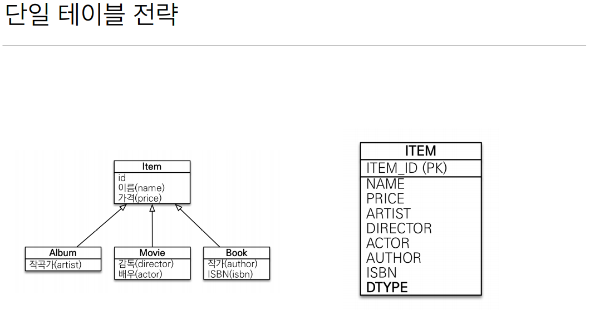

- 장점
  - 조인이 필요 없으므로 일반적으로 조회 성능이 빠름
  - 조회 쿼리가 단순함
- 단점
  - 자식 엔티티가 매핑한 컬럼은 모두 null 허용
  - 단일 테이블에 모든 것을 저장하므로 테이블이 커질 수 있다. 상황에 따라서 조회 성능이 오히려 느려질 수 있다.

### 구현 클래스마다 테이블 전략

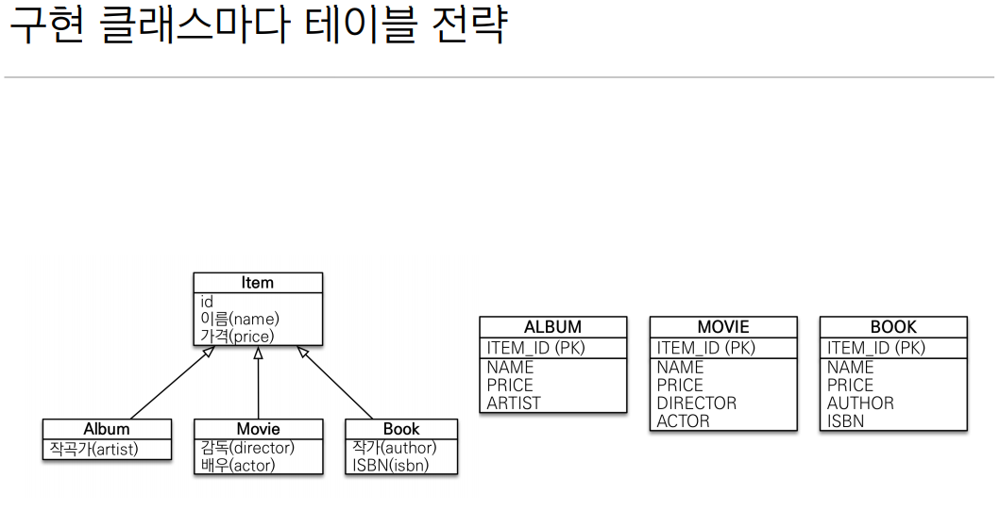

- 이 전략은 데이터베이스 설계자와 ORM 전문가 둘 다 추천X 
- 장점
  - 서브 타입을 명확하게 구분해서 처리할 때 효과적
  - not null 제약조건 사용 가능
- 단점
  - 여러 자식 테이블을 함께 조회할 때 성능이 느림(UNION SQL 필요) 
  - 자식 테이블을 통합해서 쿼리하기 어려움

## @MappedSuperclass

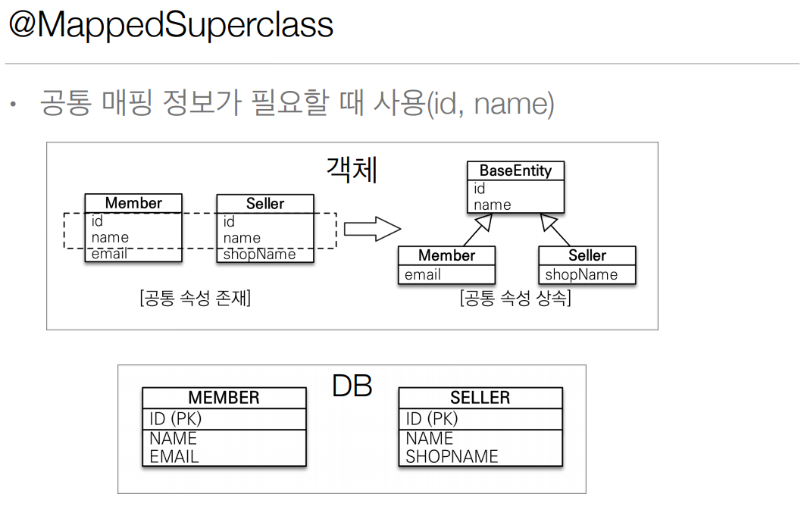

- 상속관계 매핑 X 
- 엔티티 X, 테이블과 매핑 X 
- 부모 클래스를 상속 받는 자식 클래스에 매핑 정보만 제공
- 조회, 검색 불가(em.find(BaseEntity) 불가) 
- 직접 생성해서 사용할 일이 없으므로 `추상 클래스` 권장
- 테이블과 관계 없고, 단순히 엔티티가 공통으로 사용하는 매핑 정보를 모으는 역할
- 주로 등록일, 수정일, 등록자, 수정자 같은 전체 엔티티에서 공통으로 적용하는 정보를 모을 때 사용

> @Entity 클래스는 엔티티나 @MappedSuperclass 로 지정한 클래스만 상속 가능
