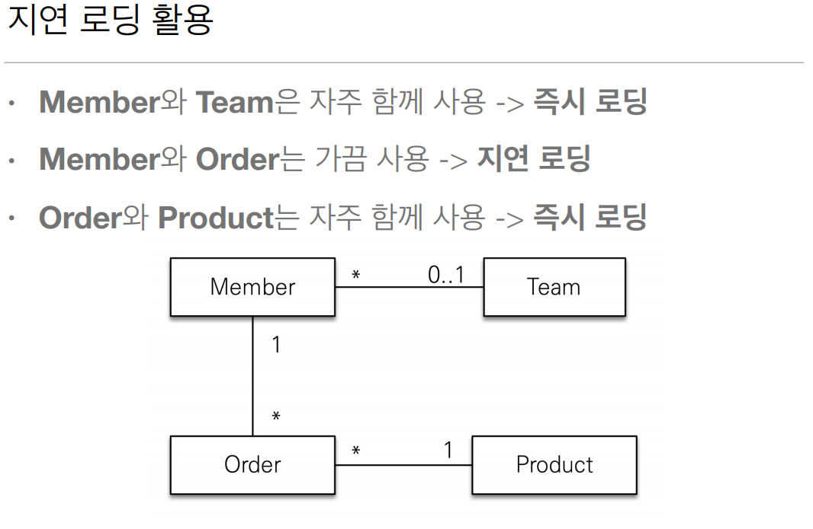
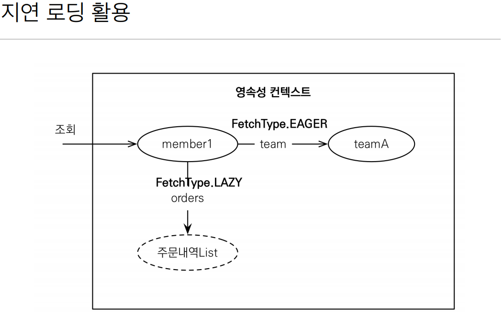
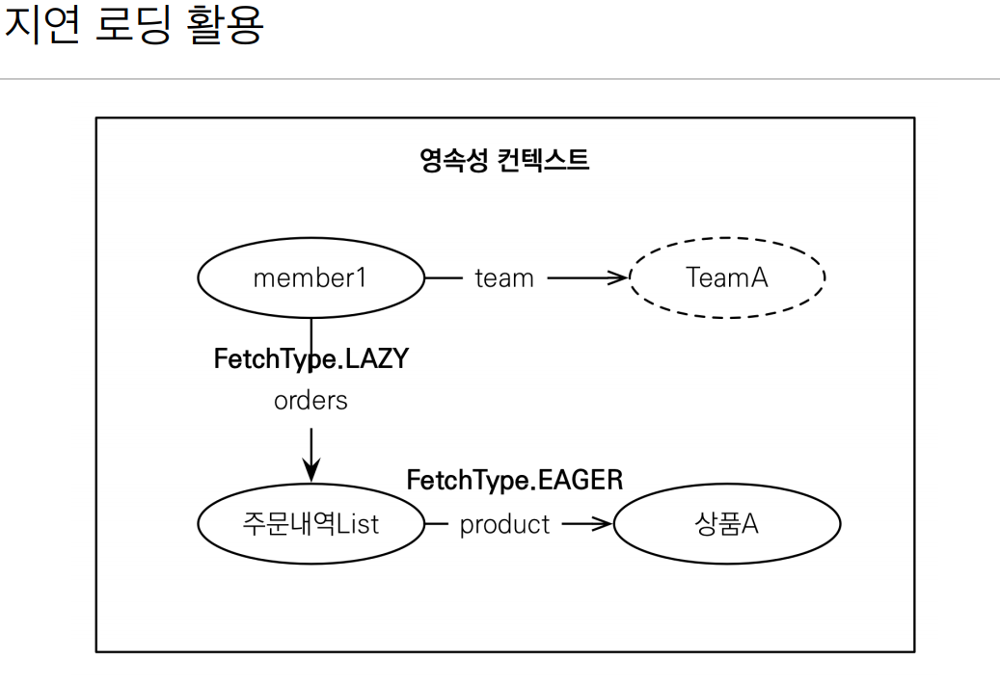
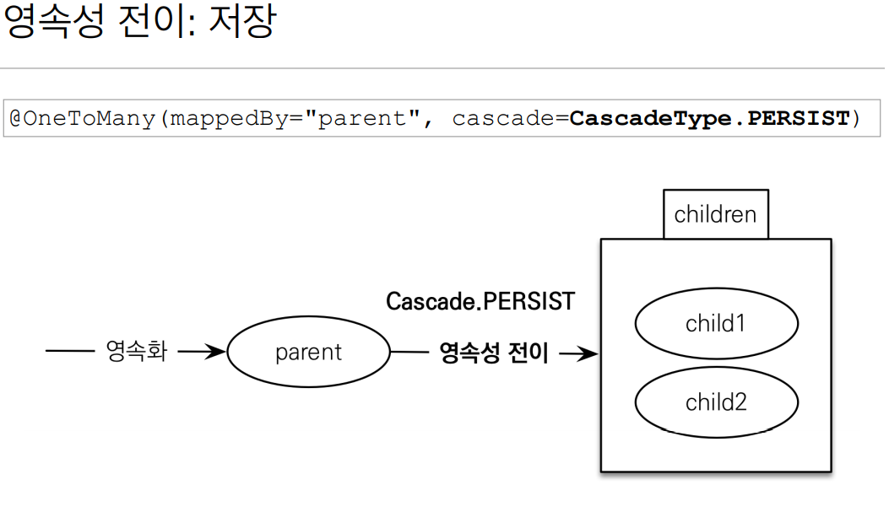

# 즉시 로딩과 지연 로딩

- 즉시 로딩(EAGER LOADING)
  - 엔티티를 조회할 때 연관된 엔티티도 함께 조회한다.
  - 설정방법 : `@ManyToOne(fetch = FetchType.EAGER)`

- 지연 로딩(LAZY LOADING)
  - 연관된 엔티티를 실제 사용할 때 조회한다.
  - 설정방법 : `@ManyToOne(fetch = FetchType.LAZY)`

## 즉시 로딩

```java
@Entity
public class User {

  @ManyToOne(fetch = FetchType.EAGER)
  @JoinColumn(name = "TEAM_ID")
  private Team team;

}
```

대부분의 JPA 구현체는 __즉시 로딩을 최적화화기 위해 가능하면 조인 쿼리를 사용한다.__

위 경우에는 외부 조인 LEFT OUTER JOIN 을 사용한다. 왜냐하면 회원이 Team 에 소속되어있지 않을 수도 있기 때문이다.

## 외부조인과 내부조인 사용

- nullable 설정에 따른 조인 전략
  - @JoinColumn(nullable = true) : 기본값, 외부 조인 사용
  - @JoinColumn(nullable = false) : 내부 조인 사용

`@ManyToOne(optional = false)` : 내부 조인 사용

JPA 는 선택적 관계면 외부 조인을 사용하고 필수 관계면 내부 조인을 사용한다.

> A와 B를 Innter-Join 하면 A와 B의 `교집합`을 얻을 수 있습니다.
> 
> A와 B를 Outer-Join 하면 A와 B의 `합집합`을 얻을 수 있습니다.
> 
> https://jetalog.net/28

## 지연 로딩 : LAZY

```java
@Entity
public class User {

  @ManyToOne(fetch = FetchType.LAZY)
  @JoinColumn(name = "TEAM_ID")
  private Team team;

}
```

```java
User user = em.find(User.class, "user1");
Team team = user.getTeam(); // 객체 그래프 탐색, 프록시 객체
team.getName(); // 팀 객체 실제 사용, 실제 team 을 사용하는 시점에 초기화(DB 조회)
```

## 즉시로딩 : EAGER

Member와 Team을 자주 함께 사용한다면? `즉시로딩(EAGER)`을 사용하여 조회. 즉, Member 조회 시 항상 Team 도 조회

```java
@Entity
public class Member {
 @Id
 @GeneratedValue
 private Long id;
 
 @Column(name = "USERNAME")
 private String name;
 
 @ManyToOne(fetch = FetchType.EAGER)
 @JoinColumn(name = "TEAM_ID")
 private Team team;
 
 .. 
}
```

JPA 구현체는 가능하면 조인을 사용해서 SQL 한번에 함께 조회


- 프록시와 즉시로딩 주의
  - `가급적 지연 로딩만 사용(특히 실무에서)`
  - 즉시 로딩을 적용하면 예상하지 못한 SQL 이 발생
  - 즉시 로딩은 JPQL 에서 N+1 문제를 일으킨다. 
  - @ManyToOne, @OneToOne은 기본이 즉시 로딩 -> LAZY로 설정
  - @OneToMany, @ManyToMany는 기본이 지연 로딩

## 지연로딩 활용







### 실무

- 모든 연관관계에 지연 로딩을 사용해라! 
- 실무에서 즉시 로딩을 사용하지 마라! 
- JPQL fetch 조인이나, 엔티티 그래프 기능을 사용해라! (뒤에서 설명) 
- 즉시 로딩은 상상하지 못한 쿼리가 나간다.

## 프록시와 컬렉션 래퍼

```java
User user = em.find(User.class, "user1");
List<Order> orders = user.getOrders();
orders.getClass().getName(); // org.hibernate.collection.internal.PersistenctBag
```

하이버네이트는 엔티티를 영속 상태로 만들 대 엔티티에 컬렉션이 있으면 컬렉션을 추적하고 관리할 목적으로 원본 컬렉션을 하이버네이트가 제공하는 내장 컬렉션으로 변경하는데 이것을 컬렉션 래퍼라고 한다.

즉, user.getOrders() 를 호출해도 컬렉션은 초기화 되지 않고, user.getOrders().get(0) 처럼 실제로 사용해야 초기화가 된다.

## JPA 기본 Fetch 전략

- @ManyToOne, @OneToOne : 즉시 로딩(FetchType.EAGER)
- @OneToMany, @ManyToMany : 지연 로딩(FetchType.LAZY)

JPA 의 기본 패치 전략은 연관된 엔티티가 하나면 즉시 로딩을, 컬렉션이면 지연 로딩을 사용한다. __추천하는 방법은 모든 연관관계에 지연 로딩(Lazy loading)을 사용하는 것이다.__ 그리고 애플리케이션 개발이 어느 정도 완료돤계에 왔을 때 실제 사용하는 상황을 보고 꼭 필요한 곳에만 즉시 로딩을 사용하도록 최적화화면 된다.

### 즉시 로딩(FetchType.EAGER)시 주의 점

- 컬렉션을 하나 이상 즉시 로딩하는 것은 권장하지 않는다.
- 컬렉션 즉시 로딩은 항상 외부 조인을 사용한다.

- @ManyToOne, @OneToOne
  - optional = false : 내부 조인
  - optional = true : 외부 조인
- @OneToMany, @ManyToMany
  - optional = false : 외부 조인
  - optional = true : 외부 조인

## 영속성 전이(CASCADE)

- 특정 엔티티를 영속 상태로 만들 때 연관된 엔티티도 함께 영속 상태로 만들도 싶을 때
  - Ex. 부모 엔티티를 저장할 때 자식 엔티티도 함께 저장.



- 주의
  - 영속성 전이는 연관관계를 매핑하는 것과 아무 관련이 없음.
  - 엔티티를 영속화할 때 연관된 엔티티도 함께 영속화하는 편리함을 제공할 뿐이다.

### CASCADE의 종류

- ALL : 모두 적용
- PERSIST : 영속
- REMOVE : 삭제
- MERGE : 병합
- REFRESH : REFRESH 
- DETACH : DETACH

## 고아 객체

- 고아 객체 제거 : 부모 엔티티와 연관관계가 끊어진 자식 엔티티를 자동으로 삭제
- orphanRemoval = true 
- Parent parent1 = em.find(Parent.class, id); 
  - parent1.getChildren().remove(0); //자식 엔티티를 컬렉션에서 제거
- DELETE FROM CHILD WHERE ID=?

- 주의
  - 참조가 제거된 엔티티는 다른 곳에서 참조하지 않는 고아 객체로 보고 삭제하는 기능
  - 참조하는 곳이 하나일 때 사용해야함! 
  - 특정 엔티티가 개인 소유할 때 사용
  - @OneToOne, @OneToMany 만 가능
  - 참고: 개념적으로 부모를 제거하면 자식은 고아가 된다. 따라서 고아 객체 제거 기능을 활성화 하면, 부모를 제거할 때 자식도 함께 제거된다. 이것은 CascadeType.REMOVE처럼 동작한다.

## 영속성 전이 + 고아 객체, 생명주기

- CascadeType.ALL + orphanRemovel=true 
- 스스로 생명주기를 관리하는 엔티티는 em.persist() 로 영속화, em.remove()로 제거
- 두 옵션을 모두 활성화 하면 부모 엔티티를 통해서 자식의 생명 주기를 관리할 수 있음
- 도메인 주도 설계(DDD)의 Aggregate Root 개념을 구현할 때 유용
