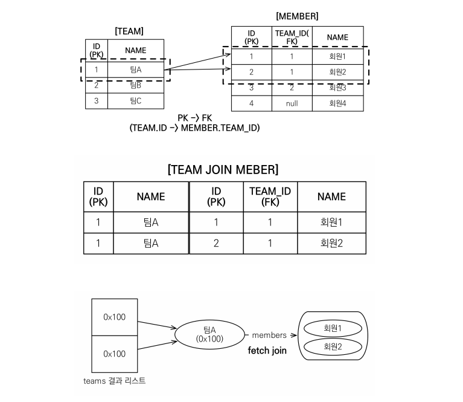

# 객체지향 쿼리 언어

## JPA는 다양한 쿼리 방법을 지원

- JPQL 
- JPA Criteria 
- QueryDSL 
- 네이티브 SQL 
- JDBC API 직접 사용, MyBatis, SpringJdbcTemplate 함께 사용

## JPQL

- __JPQL(Java Persistence Query Language)__ : `엔티티 객체를 조회하는 객체지향 쿼리`
  - 테이블이 아닌 객체를 대상으로 검색하는 객체지향 쿼리
  - `SQL 을 추상화한 JPQL 를 제공하며 특정 데이터베이스 SQL 에 의존하지 않는다.`
  - `SQL 로 변환되어 실행된다.`
  - SQL과 문법 유사, SELECT, FROM, WHERE, GROUP BY, HAVING, JOIN 등을 지원한다.
  - JPQL 은 SQL 보다 간결하다. (엔티티 직접 조회, 묵시적 조인, 다형성 지원으로 SQL 보다 코드가 간결하다.)
  - Criteria 나 QueryDSL 은 JPQL 을 편하게 작성하도록 도와주는 빌더 클래스일 뿐이므로 JPQL 이 가장 중요하다.
  - 엔티티를 저장할 때는 EntityManager.persist() 메서드를 사용하면 되므로 INSERT 문은 없다.
  - UPDATE, DELETE 문은 벌크 연산이라고 한다.
  - 엔티티와 속성은 대소문자를 구분한다. 반면 SELECT FROM AS 와 같은 JPQL 키워드는 대소문자를 구분하지 않는다.
  - 별칭(Alias)은 필수 이다. (ex. SELECT m.username FROM Member m)

```java
String jpql = "select m from Member as m where m.username = 'kim'";
List<Member> resultList = em.createQuery(jpql, Member.class).getResultList();
```

실제 실행된 SQL

```sql
select 
  member.id as id,
  member.age as age,
  member.team_id as team,
  member.name as name
from 
  Member member
where 
  member.name = 'kim'
```

## Criteria

- __Criteria__ : `JPQL 을 생성하는 빌더 클래스`
  - Criteria 의 장점은 문자가 아닌 query.select(m).where(...) 처럼 프로그래밍 코드로 JPQL 을 작성할 수 있다.
  - 예를들어, JPQL 로 작성한 쿼리에 오류가 있는 경우에는 컴파일 시점에 발견되지 않고, 런타임 시점에 발견된다.
  - JPA 2.0 부터 Criteria 지원
  - JPQL 빌더 역할
  - 장점
    - 컴파일 시점에 오류를 발견할 수 있다.
    - IDE 를 사용하면 코드 자동완성을 지원한다.
    - 동적 쿼리를 작성하기 편하다.
  - 단점
    - 모든 장점을 상쇄할 정도로 복잡하고 장황하다.
    - 사용하기 불편하고, 가독성이 떨어진다.
    - Criteria 대신에 QueryDSL 사용 권장

```java
// Criteria 사용 준비
CriteriaBuilder cb = em.getCriteriaBuilder();
CriteriaQuery<Member> query = cb.createQuery(Member.class);

// 루트 클래스(조회를 시작할 클래스)
Root<Member> m = query.from(Member.class);

// 쿼리 생성
CriteriaQuery<Member> cq = query.select(m).where(cb.equal(m.get("username"), "kim"));
List<Member> resultList = em.createQuery(cq).getResultList();
```

아쉬운 점은 m.get("username") 을 보면 필드 명을 문자로 작성했다. 이 부분도 문자가 아닌 코드로 작성하고 싶으면 `메타 모델(MetaModel)`을 사용하면 된다.

> 메타 모델(MetaModel)
>
> 자바가 제공하는 어노테이션 프로세서 기능을 사용하면 어노테이션을 분석해서 클래스를 생성할 수 있다. JPA 는 이 기능을 사용해서 Member 엔티티 클래스로부터 Member_ 라는 Criteria 전용 클래스를 생성하는데
> 이것을 메타 모델이라고한다.

```
// 메타 모델 사용 전 -> 후
m.get("username") -> m.get(Member_.username)
```

## QueryDSL

- __QueryDSL__ : JPQL 빌더 역할을 한다. 코드 기반이며 단순하고 사용하기 쉽다.
  - 작성한 코드가 JPQL 과 비슷해서 한눈에 들어온다.
  - JPA 표준은 아니고 오픈소스 프로젝트이다. 이것은 JPA 뿐만 아니라, JDO, Mongo DB, Java Collection, Jucene, Hibernate Search 도 거의 같은 문법으로 지원한다.
  - 컴파일 시점에 문법 오류를 찾을 수 있음
  - 동적쿼리 작성이 편리함
  - 단순하고 쉬움
  - `실무 사용 권장`

```java
// 준비
JPAQuery query = new JPAQuery(em);
QMember member = QMember.member;

// 쿼리, 결과 조회
List<Member> members = 
  query.from(member)
  .where(member.username.eq("kim"))
  .list(member);
```

## Native SQL

- __Native SQL__ : SQL 을 직접 사용할 수 있는 기능
  - JPQL 을 사용해도 특정 데이터베이스에 의존해야하는 기능을 사용해야할 때가 있을때 사용.
    - ex) 오라클의 CONNECT BY 등
  - SQL 은 지원하지만 JPQL 이 지원하지 않는 기능을 사용해야할 때 사용.
  - 단점은 데이터베이스에 의존적이다.

```java
String sql = "SELECT ID, AGE FROM MEMBER WHERE NAME = 'kim'";
List<Member> resultList = em.createNativeQuery(sql, Member.class).getResultList();
```

## JDBC 직접 사용, 마이바티스 같은 SQL 매퍼 프레임워크 사용

- JPA를 사용하면서 JDBC 커넥션을 직접 사용하거나, 스프링 JdbcTemplate, 마이바티스등을 함께 사용 가능
- 단 영속성 컨텍스트를 적절한 시점에 강제로 플러시 필요
- Ex. JPA를 우회해서 SQL을 실행하기 직전에 영속성 컨텍스트 수동 플러시

## JPQL(Java Persistence Query Language)

## 문법


- select m from Member as m where m.age > 18 
- 엔티티와 속성은 대소문자 구분O (Member, age) 
- JPQL 키워드는 대소문자 구분X (SELECT, FROM, where) 
- 엔티티 이름 사용, 테이블 이름이 아님(Member) 
- 별칭은 필수(m) (as는 생략가능)

## 집합과 정렬

```
select
 COUNT(m), //회원수
 SUM(m.age), //나이 합
 AVG(m.age), //평균 나이
 MAX(m.age), //최대 나이
 MIN(m.age) //최소 나이
from Member m
```

## TypeQuery, Query

- TypeQuery: 반환 타입이 명확할 때 사용

```java
TypedQuery<Member> query = 
 em.createQuery("SELECT m FROM Member m", Member.class); 
```

- Query: 반환 타입이 명확하지 않을 때 사용

```java
Query query = 
 em.createQuery("SELECT m.username, m.age from Member m");
```

## 결과 조회 API

- query.getResultList(): 결과가 하나 이상일 때, 리스트 반환
  - 결과가 없으면 빈 리스트 반환
- query.getSingleResult(): 결과가 정확히 하나, 단일 객체 반환
  - 결과가 없으면: javax.persistence.NoResultException 
  - 둘 이상이면: javax.persistence.NonUniqueResultException

### 파라미터 바인딩

JDBC 는 `위치 기준 파라미터 바인딩`만 지원하지만 JPQL 은 `이름 기준 파라미터 바인딩`도 지원한다.


#### 이름 기준 파라미터 바인딩(Name Parameters)

```java
String usernameParam = "User1";
TypedQuery<Member> query = em.createQuery("SELECT m FROM Member m WHERE m.username = :username", Member.class);
query.setParameter("username", usernameParam);
List<Member> resultList = query.getResultList();
```

- JPQL 의 대부분 API 들은 메서드 체인 방식으로 되어있어서 다음과 같이 작성 할 수 있다.

```java
TypedQuery<Member> query = em.createQuery("SELECT m FROM Member m WHERE m.username = :username", Member.class)
                            .setParameter("username", usernameParam);
                            .getResultList();
```

#### 위치 기준 파라미터 바인딩(Positional Parameters)

```java
List<Member> members = em.createQuery("SELECT m FROM Member m where m.username = ?1", Member.class)
                        .setParameter(1, usernameParam)
                        .getResultList();
```

위치 기준 파라미터 바인딩 보다 이름 기준 파라미터 바인딩을 사용하는 것이 더 명확하다.

#### SQL Injection 가능한 파라미터 바인딩 방식

아래 소개되는 바인딩 방식은 절대 사용하면 안된다. 자칫 하다간 SQL Injection 공격을 받을 수도 있다.

```java
"SELECT m FROM Member m WHERE m.username = '" + usernameParam + "'"
```

## 프로젝션(Projection)

SELECT 절에 조회할 대상을 지정하는 것을 프로젝션(Projection) 이라고 한다.

- SELECT 절에 조회할 대상을 지정하는 것
- 프로젝션 대상: 엔티티, 임베디드 타입, 스칼라 타입(숫자, 문자등 기본 데이터 타입) 
- SELECT m FROM Member m -> 엔티티 프로젝션
- SELECT m.team FROM Member m -> 엔티티 프로젝션
- SELECT m.address FROM Member m -> 임베디드 타입 프로젝션
- SELECT m.username, m.age FROM Member m -> 스칼라 타입 프로젝션
- DISTINCT로 중복 제거

### 여러 값 조회

- SELECT m.username, m.age FROM Member m 
- 1. Query 타입으로 조회
- 2. Object[] 타입으로 조회
- 3. new 명령어로 조회
  - 단순 값을 DTO로 바로 조회 
    - SELECT new jpabook.jpql.UserDTO(m.username, m.age) FROM Member m 
  - 패키지 명을 포함한 전체 클래스 명 입력
  - 순서와 타입이 일치하는 생성자 필요

### 엔티티 프로젝션

```java
SELECT m FROM Member m; // 회원
SELECT m.team FROM Member m // 회원과 연관된 팀 조회
```

> 이렇게 조회한 엔티티는 영속성 컨텍스트에서 관리된다.

```java
Member member = new Member();
member.setUsername("member1");
member.setAge(10);
em.persist(member);

em.flush();
em.clear();

List<Member> result = em.createQuery("select m from Member m", Member.class).getResultList();
Member findMember = result.get(0);
findMember.setAge(20); // result 가 영속성 컨텍스트에서 관리되기 때문에 값이 변경된다.
```

### 임베디드 타입 프로젝션

임베디드 타입을 조회하려면 엔티티가 시작점이 되어야 한다.

```java
String query = "SELECT o.address FROM Order o";
List<Address> addresses = em.createQuery(query, Address.class).getResultList();
```

- 실행된 SQL

```sql
select
  order.city,
  order.street,
  order.zipcode,
from Order order
```

> 임베디드 타입은 엔티티 타입이 아닌 값 타입이다. 따라서 이렇게 직접 조회한 임베디드 타입은 영속성 컨텍스트에서 관리되지 않는다.

### 스칼라 타입 프로젝션

숫자, 문자, 날짜와 같은 기본 데이터 타입들을 스칼라 타입이라고 한다.

```java
List<String> usernames = em.createQuery("SELECT m.username FROM Member m", Stirng.class).getResultList();
```

```java
Double orderAmountAvg = em.createQuery("SELECT AVG(o.orderAmount) FROM Order o", Double.class).getSingleResult();
```

### 여러 타입 조회

```java
List<Object[]> resultList = em.createQuery("SELECT o.member, o.product, o.orderAmount FROM Order o").getResultList();
for(Object[] row : resultList) {
  Member member = (Member) row[0]; // 엔티티
  Product product = (Product) row[1]; // 엔티티
  int orderAmount = (Integer) row[2]; // 스칼라
}
```

## 페이징 API

JPA는 페이징을 다음 두 API로 추상화

- setFirstResult(int startPosition) : 조회 시작 위치(0부터 시작) 
- setMaxResults(int maxResult) : 조회할 데이터 수

- Example

```java
 //페이징 쿼리
 String jpql = "select m from Member m order by m.name desc";
 List<Member> resultList = em.createQuery(jpql, Member.class)
 .setFirstResult(10)
 .setMaxResults(20)
 .getResultList();
```

### MySQL 방언

```sql
SELECT
 M.ID AS ID,
 M.AGE AS AGE,
 M.TEAM_ID AS TEAM_ID,
 M.NAME AS NAME 
FROM
 MEMBER M 
ORDER BY
 M.NAME DESC LIMIT ?, ?
``` 

### Oracle 방언

```sql
SELECT * FROM
 ( SELECT ROW_.*, ROWNUM ROWNUM_ 
 FROM
   ( SELECT
     M.ID AS ID,
     M.AGE AS AGE,
     M.TEAM_ID AS TEAM_ID,
     M.NAME AS NAME 
     FROM MEMBER M 
     ORDER BY M.NAME 
   ) ROW_ 
 WHERE ROWNUM <= ?
 ) 
WHERE ROWNUM_ > ?
```

## 조인

- 내부 조인 : SELECT m FROM Member m [INNER] JOIN m.team t
- 외부 조인 : SELECT m FROM Member m LEFT [OUTER] JOIN m.team t 
- 세타 조인 : select count(m) from Member m, Team t where m.username = t.name
  - Member 와 Team 을 카티시안 곱으로 불러와서 where 조건으로 검색한다.
  - 주로, `연관 관계가 없는 애들 끼리` 조회하고 싶은 경우 사용한다.

### ON 절

- ON 절을 활용한 조인(JPA 2.1부터 지원) 
  - 1. 조인 대상 필터링
  - 2. 연관관계 없는 엔티티 외부 조인(하이버네이트 5.1부터)

### 1. 조인 대상 필터링

- Ex. 회원과 팀을 조인하면서, 팀 이름이 A인 팀만 조인
  - JPQL : SELECT m, t FROM Member m LEFT JOIN m.team t on t.name = 'A' 
  - SQL : SELECT m.*, t.* FROM Member m LEFT JOIN Team t ON m.TEAM_ID=t.id and t.name='A'

### 2. 연관관계 없는 엔티티 외부 조인

- Ex. 회원의 이름과 팀의 이름이 같은 대상 외부 조인
  - JPQL : SELECT m, t FROM Member m LEFT JOIN Team t on m.username = t.name
  - SQL : SELECT m.*, t.* FROM Member m LEFT JOIN Team t ON m.username = t.name

## 서브 쿼리

- 나이가 평균보다 많은 회원
  - select m from Member m where m.age > (select avg(m2.age) from Member m2) 
- 한 건이라도 주문한 고객
  - select m from Member m where (select count(o) from Order o where m = o.member) > 0

### 나이가 평균보다 많은 회원
select m from Member m
where m.age > (select avg(m2.age) from Member m2) 
• 한 건이라도 주문한 고객
select m from Member m
where (select count(o) from Order o where m = o.member) > 0

### 서브 쿼리 지원 함수

- `[NOT] EXISTS (subquery)` : 서브쿼리에 결과가 존재하면 참
  - {ALL | ANY | SOME} (subquery) 
  - ALL 모두 만족하면 참
  - ANY, SOME: 같은 의미, 조건을 하나라도 만족하면 참
- `[NOT] IN (subquery)` : 서브쿼리의 결과 중 하나라도 같은 것이 있으면 참

- Example
  - 팀A 소속인 회원
    - select m from Member m where exists (select t from m.team t where t.name = ‘팀A') 
  - 전체 상품 각각의 재고보다 주문량이 많은 주문들
    - select o from Order o where o.orderAmount > ALL (select p.stockAmount from Product p) 
  - 어떤 팀이든 팀에 소속된 회원
    - select m from Member m where m.team = ANY (select t from Team t)

### JPA 서브 쿼리 한계

- JPA는 WHERE, HAVING 절에서만 서브 쿼리 사용 가능
- SELECT 절도 가능(하이버네이트에서 지원) 
- FROM 절의 서브 쿼리는 현재 JPQL 에서 불가능
- 조인으로 풀 수 있으면 풀어서 해결

## JPQL 타입 표현

- 문자: ‘HELLO’, ‘She’’s’ 
- 숫자: 10L(Long), 10D(Double), 10F(Float) 
- Boolean: TRUE, FALSE 
- ENUM: jpabook.MemberType.Admin (패키지명 포함) 
- 엔티티 타입: TYPE(m) = Member (상속 관계에서 사용)

## JPQL 기타

- SQL과 문법이 같은 식
- EXISTS, IN 
- AND, OR, NOT 
- `=, >, >=, <, <=, <>`
- BETWEEN, LIKE, IS NULL

## 조건식 - CASE 식


- COALESCE: 하나씩 조회해서 null이 아니면 반환
- NULLIF: 두 값이 같으면 null 반환, 다르면 첫번째 값 반환

- 사용자 이름이 없으면 이름 없는 회원을 반환
  - select coalesce(m.username,'이름 없는 회원') from Member m
- 사용자 이름이 ‘관리자’면 null을 반환하고 나머지는 본인의 이름을 반환
  - select NULLIF(m.username, '관리자') from Member m

## JPQL 기본 함수

- CONCAT 
- SUBSTRING 
- TRIM 
- LOWER, UPPER 
- LENGTH 
- LOCATE 
- ABS, SQRT, MOD 
- SIZE, INDEX(JPA 용도)

## 사용자 정의 함수 호출

- 하이버네이트는 사용전 방언에 추가해야 한다. 
  - 사용하는 DB 방언을 상속받고, 사용자 정의 함수를 등록한다.
  - select function('group_concat', i.name) from Item i

## 경로 표현식

.(점)을 찍어 객체 그래프를 탐색하는 것

```
select m.username -> 상태 필드
 from Member m 
 join m.team t -> 단일 값 연관 필드
 join m.orders o -> 컬렉션 값 연관 필드
where t.name = '팀A
```

- 상태 필드(state field): 단순히 값을 저장하기 위한 필드 (ex: m.username) 
- 연관 필드(association field): 연관관계를 위한 필드
- 단일 값 연관 필드: @ManyToOne, @OneToOne, 대상이 엔티티(ex: m.team) 
- 컬렉션 값 연관 필드: @OneToMany, @ManyToMany, 대상이 컬렉션(ex: m.orders)

### 특징

- 상태 필드(state field): 경로 탐색의 끝, 탐색X 
- 단일 값 연관 경로: 묵시적 내부 조인(inner join) 발생, 탐색 O 
- 컬렉션 값 연관 경로: 묵시적 내부 조인 발생, 탐색 X 
- FROM 절에서 명시적 조인을 통해 별칭을 얻으면 별칭을 통해 탐색 가능

### 상태 필드 경로 탐색

- JPQL: select m.username, m.age from Member m 
- SQL: select m.username, m.age from Member m

### 단일 값 연관 경로 탐색

- JPQL
  - select o.member from Order o 
- SQL

```
select m.* 
 from Orders o 
 inner join Member m on o.member_id = m.id
```

### 명시적 조인, 묵시적 조인

- 명시적 조인: join 키워드 직접 사용
  - select m from Member m join m.team t
- 묵시적 조인: 경로 표현식에 의해 묵시적으로 SQL 조인 발생(내부 조인만 가능) 
  - select m.team from Member m
  - `가급적 실무에서는 묵시적 조인이 발생하도록 쿼리를 짜면 안된다.` 쿼리 튜닝이 어려워 짐.

### 경로 표현식 예제

- select o.member.team from Order o -> 성공
- select t.members from Team -> 성공
- select t.members.username from Team t -> 실패
- select m.username from Team t join t.members m -> 성공

### 경로 탐색을 사용한 묵시적 조인 시 주의사항

- 항상 내부 조인
- 컬렉션은 경로 탐색의 끝, 명시적 조인을 통해 별칭을 얻어야함
- 경로 탐색은 주로 SELECT, WHERE 절에서 사용하지만 묵시적 조인으로 인해 SQL의 FROM (JOIN) 절에 영향을 줌

### 실무 조언

- `가급적 묵시적 조인 대신에 명시적 조인 사용`
- 조인은 SQL 튜닝에 중요 포인트
- 묵시적 조인은 조인이 일어나는 상황을 한눈에 파악하기 어려움

## JPQL - 페치 조인(fetch join)

`실무에서 정말정말 중요함`

- SQL 조인 종류X 
- JPQL 에서 `성능 최적화`를 위해 제공하는 기능
- 연관된 엔티티나 컬렉션을 SQL 한 번에 함께 조회하는 기능
- join fetch 명령어 사용
- `페치 조인 ::= [ LEFT [OUTER] | INNER ] JOIN FETCH 조인경로`

### 엔티티 페치 조인

- 회원을 조회하면서 연관된 팀도 함께 조회(SQL 한 번에) 
- SQL 을 보면 회원 뿐만 아니라 `팀(T.*)`도 함께 SELECT
- JPQL
  - select `m` from Member m `join fetch` m.team 
- 실제 실행되는 SQL
  - SELECT `M.*, T.*` FROM MEMBER M


- 지연로딩 전략 사용 시

```java
String query = "select m From Member m";

List<Member> result = em.createQuery(query, Member.class)
  .getResultList();
  
for(Member member : result) {
  System.out.println("member = " + member.getUsername() + ", " + member.getTeam().getName());
  // 회원1, 팀A (SQL)
  // 회원2, 팀A (1차 캐시)
  // 회원3, 팀B (SQL)
  // 팀이 각각 다르면 최악의 경우에 그 만큼의 쿼리가 나간다. 이러한 현상을 N + 1 이라고 한다.
}
```

- 페치 조인 사용 시

```java
String query = "select m From Member m join fetch m.team";

List<Member> result = em.createQuery(query, Member.class)
  .getResultList();
  
for(Member member : result) {
  // 위에서 한 번에 다 가져왔기 때문에 team 은 프록시가 아니라 실제 엔티티이다.
  System.out.println("member = " + member.getUsername() + ", " + member.getTeam().getName());
}
```

### 컬렉션 페치 조인

- 일대다 관계, 컬렉션 페치 조인
- JPQL

```
select t
from Team t join fetch t.members
where t.name = ‘팀A' 
```

- SQL

```
SELECT T.*, M.*
FROM TEAM T
INNER JOIN MEMBER M ON T.ID=M.TEAM_ID
WHERE T.NAME = '팀A'
INNER JOIN TEAM T ON M.TEAM_ID=T.ID
```




### 페치 조인과 DISTINCT

- SQL의 DISTINCT는 중복된 결과를 제거하는 명령
- JPQL의 DISTINCT 2가지 기능 제공
  - 1. SQL에 DISTINCT를 추가
  - 2. 애플리케이션에서 엔티티 중복 제거

select distinct t from Team t join fetch t.members where t.name = ‘팀A’

SQL에 DISTINCT를 추가하지만 데이터가 다르므로 SQL 결과에서 중복제거 실패


### 페치 조인과 일반 조인의 차이

- 일반 조인 실행시 연관된 엔티티를 함께 조회하지 않음
- JPQL 은 결과를 반환할 때 연관관계 고려 X 
- 단지 SELECT 절에 지정한 엔티티만 조회할 뿐
- 여기서는 팀 엔티티만 조회하고, 회원 엔티티는 조회 X
- 페치 조인을 사용할 때만 연관된 엔티티도 함께 조회(즉시 로딩) 
- 페치 조인은 객체 그래프를 SQL 한번에 조회하는 개념


### 페치 조인의 특징과 한계

- 페치 조인 대상에는 별칭을 줄 수 없다. 
  - 하이버네이트는 가능, 가급적 사용X 
- 둘 이상의 컬렉션은 페치 조인 할 수 없다. 
- 컬렉션을 페치 조인하면 페이징 API(setFirstResult, setMaxResults)를 사용할 수 없다. 
  - 일대일, 다대일 같은 단일 값 연관 필드들은 페치 조인해도 페이징 가능
    - 일대다는 X -> 다대일로 쿼리를 바꿔서 사용하여 해결할 수도 있음.
    - @BatchSize 를 이용해서 해결할 수도 있음. @OneToMany 에 설정해도되고, 글로벌 세팅(persistence.xml)으로 가져갈 수도 있다.
    - hibernate.default_batch_fetch_size value="100"
  - 하이버네이트는 경고 로그를 남기고 메모리에서 페이징(매우 위험)
- 연관된 엔티티들을 SQL 한 번으로 조회 - 성능 최적화
- 엔티티에 직접 적용하는 글로벌 로딩 전략보다 우선함
- @OneToMany(fetch = FetchType.LAZY) // 글로벌 로딩 전략
- 실무에서 글로벌 로딩 전략은 모두 지연 로딩
- 최적화가 필요한 곳은 페치 조인 적용

### 페치조인 정리

- 모든 것을 페치 조인으로 해결할 수 는 없음
- 페치 조인은 객체 그래프를 유지할 때 사용하면 효과적
- 여러 테이블을 조인해서 엔티티가 가진 모양이 아닌 전혀 다른 결과를 내야 하면, 페치 조인 보다는 일반 조인을 사용하고 필요한 데이터들만 조회해서 DTO 로 반환하는 것이 효과적

## JPQL - 다형성 쿼리

- TYPE
  - 조회 대상을 특정 자식으로 한정
  - Ex. Item 중에 Book, Movie를 조회해라
  - JPQL
    - select i from Item i where type(i) IN (Book, Movie) 
  - SQL
    - select i from i where i.DTYPE in (‘B’, ‘M’)

- TREAT(JPA 2.1)
  - 자바의 타입 캐스팅과 유사
  - 상속 구조에서 부모 타입을 특정 자식 타입으로 다룰 때 사용
  - FROM, WHERE, SELECT(하이버네이트 지원) 사용
  - Ex. 부모인 Item과 자식 Book이 있다. 
  - JPQL
    - select i from Item i where treat(i as Book).auther = ‘kim’ 
  - SQL
    - select i.* from Item i where i.DTYPE = ‘B’ and i.auther = ‘kim’

## JPQL - 엔티티 직접 사용

### 기본 키 값

JPQL 에서 엔티티를 직접 사용하면 SQL 에서 해당 엔티티의 기본 키 값을 사용

- JPQL
  - select count(m.id) from Member m // 엔티티의 아이디를 사용
  - select count(m) from Member m // 엔티티를 직접 사용 
- SQL (JPQL 둘다 같은 다음 SQL 실행)
  - select count(m.id) as cnt from Member m


### 외래 키 값


## JPQL - Named 쿼리(정적 쿼리)

- 미리 정의해서 이름을 부여해두고 사용하는 JPQL 
- 정적 쿼리
- 어노테이션, XML 에 정의
- 애플리케이션 로딩 시점에 초기화 후 재사용
- 애플리케이션 로딩 시점에 쿼리를 검증

### Named 쿼리 - 어노테이션


### Named 쿼리 - XML에 정의


- XML 이 항상 우선권을 가진다. 
- 애플리케이션 운영 환경에 따라 다른 XML 을 배포할 수 있다.

## JPQL - 벌크 연산

- 재고가 10 개 미만인 모든 상품의 가격을 10% 상승하려면? 
- JPA 변경 감지 기능으로 실행하려면 너무 많은 SQL 실행
  - 1. 재고가 10 개 미만인 상품을 리스트로 조회한다. 
  - 2. 상품 엔티티의 가격을 10% 증가한다. 
  - 3. 트랜잭션 커밋 시점에 변경감지가 동작한다. 
- 변경된 데이터가 100 건이라면 100 번의 UPDATE SQL 실행


### 벌크 연산 주의

- 벌크 연산은 영속성 컨텍스트를 무시하고 데이터베이스에 직접 쿼리
- 벌크 연산을 먼저 실행
- 벌크 연산 수행 후 영속성 컨텍스트 초기화
